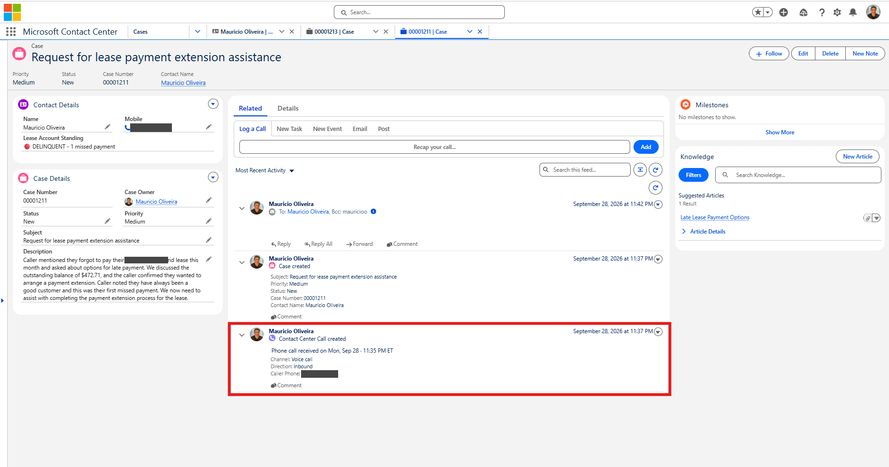
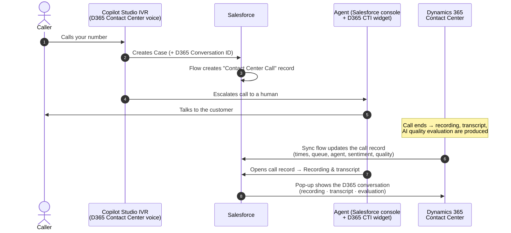
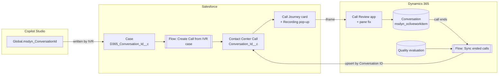

# Dynamics 365 Contact Center ✕ Salesforce — Call Journey

**Your agents work in Salesforce. Your calls run on Dynamics 365 Contact Center.**
This project connects the two, so every phone call shows up in Salesforce with its full story:

- when it came in
- how long the virtual agent (IVR) handled it
- how long the caller waited
- who answered
- how the customer felt
- one click to **play the recording, read the transcript and see the AI quality evaluation**, without leaving Salesforce

> 🧩 Everything in this repo is **ready to install**: one `.zip` for Salesforce, one `.zip` for Dynamics 365, and two small changes in Copilot Studio. No coding required. Prefer to hand it over? [Let an AI assistant install it for you](#let-an-ai-assistant-install-it-for-you) by pasting one prompt.

## What it looks like

**1. The IVR creates the Case, and the call shows up on it.** The Case header gets a *Call Recording & Transcript* link, and the feed shows *"Contact Center Call created"* with the call's time, channel, direction and caller.



**2. Open the call to see its whole journey.** *Call received → Virtual agent → Voice queue → Agent answered → Call ended*, with durations, sentiment and caller number. One click on **Recording & transcript** opens the Dynamics 365 recording, transcript and quality evaluation in a pop-up inside Salesforce. The card has the same design as the [ServiceNow version](https://github.com/moliveirapinto/d365-contact-center-servicenow-call-journey).


**3. Play the recording without leaving Salesforce.** The pop-up shows the Dynamics 365 conversation: audio player with waveform, quality score trendline, transcript and call metrics. On the right is the **AI quality evaluation**: plan score, AI summary, suggested actions and every quality indicator with its reasoning.


---

## Table of contents

1. [What you get](#what-you-get)
2. [How it works](#how-it-works)
3. [Before you start](#before-you-start)
4. [Let an AI assistant install it for you](#let-an-ai-assistant-install-it-for-you)
5. [Install in 4 steps](#install-in-4-steps)
6. [What's in this repo](#whats-in-this-repo)
7. [Customizing](#customizing)
8. [Troubleshooting](#troubleshooting)
9. [Optional extras](#optional-extras)
10. [Uninstalling](#uninstalling)
11. [Disclaimer & license](#disclaimer--license)

---

## What you get

### In Salesforce

| Feature | What the agent sees |
|---|---|
| **Contact Center Call record** | One record per phone call, created automatically when the IVR opens a Case. Title reads like *"Phone call received on Fri, Sep 25 · 9:24 PM ET"*. It's linked to the Case and the Contact. |
| **Call Journey card** | A visual timeline on top of the call record: *Call received → Virtual agent → Queue → Agent answered → Call ended*, with the call's date and time, status, durations, sentiment and the caller's number. Same design as the ServiceNow version. |
| **Recording & transcript button** | Open a large pop-up **inside Salesforce** showing the Dynamics 365 conversation: audio player, transcript, AI summary, call metrics and the **Quality Evaluation** side pane. |
| **Case link** | A *"Call Recording & Transcript"* link on the Case (optional; you add it to your Case layout). |
| **Call details** | Queue, agent, talk/wait/handle time, sentiment and quality score, filled in automatically when the call ends. |

### In Dynamics 365 Contact Center

| Component | Purpose |
|---|---|
| **Contact Center Call Review** app | A lightweight, full-screen conversation viewer, used by the Salesforce pop-up. |
| **Evaluation Details pane fix** | Fixes Microsoft's *"Error loading control"* in the Quality Evaluation side pane (see [why](#why-the-evaluation-pane-fix-is-needed)). |
| **Sync flow** (Power Automate) | When a voice call ends, it sends the call metrics and the AI quality evaluation to the matching Salesforce call record. |

### In Copilot Studio (your IVR agent)

The IVR agent writes the **Dynamics 365 conversation ID** into the Salesforce Case it creates. That one value is what ties everything together.

---

## How it works





---

## Before you start

You need:

| ✔ | Requirement |
|---|---|
| ☐ | **Dynamics 365 Contact Center** with a **voice** channel, and a **Copilot Studio agent** answering calls (the IVR) |
| ☐ | The **Dynamics 365 Contact Center for Salesforce** integration (the CTI widget inside the Salesforce console) already working |
| ☐ | Your Copilot Studio IVR **creates a Salesforce Case** before handing the call to an agent (Salesforce connector → *Create record*). If yours doesn't yet, the Copilot Studio guide shows the one action to add. |
| ☐ | **Salesforce**: a System Administrator login (a **sandbox** is recommended for your first try) |
| ☐ | **Dynamics 365 / Power Platform**: System Administrator or System Customizer in the Contact Center environment |
| ☐ | *(Optional)* **Quality evaluation** enabled in Dynamics 365 Contact Center, if you want quality scores |

⏱ **Time needed:** about 30–45 minutes the first time.

---

## Let an AI assistant install it for you

Copy the whole prompt below into an AI assistant that can work in a browser and/or run commands (for example **Claude** with computer or browser use, **Claude Code**, or a similar agent). It asks you a few questions, installs everything in the right order (Salesforce, Dynamics 365, Copilot Studio), checks each step and finishes with a test call. If your assistant cannot operate a browser, the prompt switches to a guided mode where it walks you through each click.

**You stay in control:** you sign in yourself (including MFA), and the assistant stops and asks whenever something is not as expected or before anything that affects live calls.

````text
You are an installation engineer. Install the community package "Dynamics 365 Contact Center x Salesforce Call Journey" for me, end to end, carefully and safely. It has three parts that must be done IN ORDER: Salesforce, then Dynamics 365, then Copilot Studio.

SOURCE
Repository: https://github.com/moliveirapinto/d365-contact-center-salesforce-call-journey
README (source of truth): https://raw.githubusercontent.com/moliveirapinto/d365-contact-center-salesforce-call-journey/main/README.md
Step guides: docs/1-install-salesforce.md, docs/2-install-dynamics365.md, docs/3-configure-copilot-studio.md, docs/4-test-and-troubleshoot.md (same repository, main branch).
Files:
  A) Salesforce package (do NOT unzip): https://raw.githubusercontent.com/moliveirapinto/d365-contact-center-salesforce-call-journey/main/salesforce/D365ContactCenter_CallJourney_Salesforce.zip
  B) Dynamics 365 solution (do NOT unzip): https://raw.githubusercontent.com/moliveirapinto/d365-contact-center-salesforce-call-journey/main/dynamics365/D365ContactCenterSalesforceCallJourney_1_1_0_0.zip
  C) Copilot Studio topic: https://raw.githubusercontent.com/moliveirapinto/d365-contact-center-salesforce-call-journey/main/copilot-studio/d365-context-variables-topic.yaml
Read the README and the four step guides first. If they and this prompt disagree, follow the repository and tell me.

HOW TO WORK
- Use the tools you have (browser, shell, Salesforce CLI "sf", file download). If you cannot operate a browser, switch to GUIDE MODE: give me ONE step at a time with exact click paths, wait for me to say "done", and check what I report before moving on. If you cannot open URLs, ask me to paste the README and guides and to download the files myself.
- Never guess. If a screen, value or count differs from what this prompt says, STOP and tell me exactly what you see.
- Retry a failed action at most twice. Then stop and show me the exact error.
- Only do what is listed here. Do not delete or change any other record, field, flow, topic, form or solution. Never touch a Salesforce org, Power Platform environment or Copilot Studio agent other than the ones I name.
- Sign-in: I sign in myself, including MFA. Tell me when you need it, then wait. Do not ask me to paste passwords or tokens into this chat, and never store any.
- Anything that can affect LIVE calls (publishing the Copilot Studio agent, turning on the sync flow in a production environment, deploying to a production Salesforce org) needs my explicit "yes" first. Say what will change.
- After each phase give me one or two lines of status (OK / WARNING / FAILED) before you continue.

PHASE 0 - QUESTIONS (ask all in one message, then wait)
1. Salesforce: sandbox or production? Which org (alias or login URL) and which admin username? If it is production, warn me and continue only after I answer an explicit "yes, production". A sandbox is recommended for a first try.
2. Dynamics 365: the Contact Center environment URL (for example https://contoso.crm.dynamics.com) and the environment's name as shown in Power Apps.
3. Time zone for call titles, as three values: standard-time offset from UTC in hours (for example -5), daylight saving rule (US, EU, or blank if none) and a short label (for example ET). Common values: US Eastern -5/US/ET; US Central -6/US/CT; US Mountain -7/US/MT; US Pacific -8/US/PT; Brazil -3/blank/BRT; UK and Ireland 0/EU/GMT; Central Europe 1/EU/CET; India 5.5/blank/IST; Sydney 10/blank/AEST. Blank for all three means UTC.
4. Salesforce users who need the permission set "D365 Contact Center Call Access": (a) every agent who uses the Salesforce console, (b) the Salesforce user the Copilot Studio agent uses to create Cases, (c) the Salesforce user for the Power Automate connection (often an integration user). Give me usernames.
5. Copilot Studio: the name of the IVR agent. Does it already create a Salesforce Case (Salesforce connector, "Create record", object Case) before transferring to a human agent? Is this agent used by LIVE callers right now?
6. Which Dataverse security roles do the agents have (for example Omnichannel agent, Customer Service Representative, Quality Manager)? The Contact Center Call Review app will be shared with them.
7. Optional Case extras, yes or no each: (a) "Call Recording & Transcript" link in the Case header (compact layout), (b) a Contact Center Calls related list on Case and Contact, (c) the Call Timeline component on the Case page.
8. Confirm I can sign in to: (a) Salesforce as a System Administrator, (b) Power Apps with System Administrator or System Customizer in the Contact Center environment, (c) Copilot Studio as a maker of the IVR agent. Also confirm the Dynamics 365 Contact Center widget (CTI) already works inside the Salesforce console, and that Contact Center has a voice channel.

PHASE 1 - PREFLIGHT
1. Download files A, B and C. Expected sizes: A 20,420 bytes, B 13,418 bytes (different only if the README names newer files). A must be a valid zip whose first entry is package.xml; B a valid zip containing solution.xml, customizations.xml, a Workflows/*.json file and a WebResources/ file.
2. Salesforce, once I have signed in: check that the object Contact_Center_Call__c and the field Case.D365_Conversation_Id__c do NOT exist yet. If they exist, an earlier version may be installed: STOP, tell me, and ask whether to upgrade over it.
3. Power Apps, once signed in to the right environment: confirm it has the table "Conversation" (logical name msdyn_ocliveworkitem). If not, STOP. Check whether the solution "D365 Contact Center - Salesforce Call Journey" (unique name D365ContactCenterSalesforceCallJourney) already exists; if it does, tell me its version and ask before importing over it.

PHASE 2 - SALESFORCE PACKAGE (docs/1-install-salesforce.md)
1. Preferred, with the Salesforce CLI: sign in with "sf org login web --alias <alias>" (add --instance-url https://test.salesforce.com for a sandbox); I complete the sign-in in the browser.
2. VALIDATE FIRST, changing nothing: sf project deploy start --metadata-dir <path to the downloaded file A> --single-package --target-org <alias> --dry-run --wait 10
   Expect Succeeded with 48 components and 0 errors. If it fails, STOP and show me the failing component and reason. A known cause is "Field D365_Conversation_Id__c already exists": I must rename my own field first.
3. After I approve, run the same command WITHOUT --dry-run (same file path). Leave the test level at its default (the package has no Apex code). Expect Succeeded, 48 components.
4. No CLI? Use Workbench (https://workbench.developerforce.com): choose Sandbox or Production, log in, migration > Deploy, choose file A, tick "Rollback On Error" and "Single Package", Next, Deploy, wait for Succeeded.
5. Verify and report each item: objects Contact_Center_Call__c and D365_Contact_Center_Settings__c exist; Case has fields D365_Conversation_Id__c and D365_Call_Recording__c; the flow D365CC_Create_Call_From_Case is ACTIVE (Tooling API: SELECT DeveloperName, ActiveVersionId FROM FlowDefinition WHERE DeveloperName='D365CC_Create_Call_From_Case', ActiveVersionId must not be empty); the permission set D365_Contact_Center_Call_Access exists; the Trusted URL D365_Contact_Center is active with endpoint https://*.dynamics.com (SELECT DeveloperName, IsActive, EndpointUrl FROM CspTrustedSite WHERE DeveloperName='D365_Contact_Center').

PHASE 3 - SALESFORCE SETTINGS
Write the org-level default of the custom setting "D365 Contact Center Settings". Run this Apex (sf apex run --file, or Developer Console > Execute Anonymous), with my real values and leaving out any line for a value I left blank:
  D365_Contact_Center_Settings__c s = D365_Contact_Center_Settings__c.getOrgDefaults();
  s.Org_Url__c = 'https://contoso.crm.dynamics.com';
  s.Time_Zone_Offset__c = -5;
  s.Daylight_Saving_Rule__c = 'US';
  s.Time_Zone_Label__c = 'ET';
  upsert s;
Leave App_Id__c (Call Review App ID) empty for now; Phase 5 fills it. Verify with SELECT Org_Url__c, App_Id__c, Time_Zone_Offset__c, Daylight_Saving_Rule__c, Time_Zone_Label__c FROM D365_Contact_Center_Settings__c and confirm exactly one org-level row with my values. If the Apex route fails, do it in the UI: Setup > Custom Settings > D365 Contact Center Settings > Manage > New (the one at the top, "Default Organization Level Value") and fill the fields.

PHASE 4 - ACCESS
Assign the permission set to every user I listed: sf org assign permset --name D365_Contact_Center_Call_Access --on-behalf-of <username> --target-org <alias> (once per user, or repeat the flag). Verify with SELECT Assignee.Username FROM PermissionSetAssignment WHERE PermissionSet.Name='D365_Contact_Center_Call_Access' and confirm each user is listed. If an assignment fails because of a license problem, STOP and tell me which user.

PHASE 5 - DYNAMICS 365 (docs/2-install-dynamics365.md)
1. Open https://make.powerapps.com, ask me to sign in, and select the environment I named.
2. Solutions > Import solution > Browse > file B > Next. On the connections page:
   - "D365 Contact Center - Dataverse": select my Microsoft Dataverse connection, or create one (I sign in).
   - "D365 Contact Center - Salesforce": create a new Salesforce connection, login type Production or Sandbox to match my org, and I sign in with the Salesforce user that received the permission set in Phase 4.
   Click Import and wait for "Solution imported successfully".
3. Open the solution "D365 Contact Center - Salesforce Call Journey" > Cloud flows > "D365 Contact Center - Sync ended calls to Salesforce". If this is a production environment, ask me before turning it on. Turn it ON. If Turn on is greyed out, open each item under Connection references, choose a connection, Save, then retry. Reload and confirm it shows On.
4. Conversation form fix (do it carefully, change nothing else on the form): Tables > Conversation (msdyn_ocliveworkitem) > Forms > "Conversation Form" (type Main) > in the designer open Form libraries (left rail) > Add library > search new_d365cc_evaluationpanefix > tick it > Add. Click an empty area so the FORM itself is selected, open the Events tab, under On load click Event handler and set: Library new_d365cc_evaluationpanefix.js; Function D365CC.EvaluationPaneFix.onLoad; Enabled ON; Pass execution context as first parameter ON. Done > Save and publish. If that exact handler already exists, do not add a second one. Reopen the form and confirm the handler is there.
5. Share the app: Apps > "Contact Center Call Review" > ... > Share. Add the security roles I named (never "everyone") > Share.
6. Get the app id: Apps > "Contact Center Call Review" > Play. In the browser address bar copy the value after appid= .
7. Put it into Salesforce: run the Phase 3 Apex again with one more line, s.App_Id__c = '<app id>'; keep the other values, upsert, then re-run the verification query and confirm App_Id__c is set.

PHASE 6 - COPILOT STUDIO (docs/3-configure-copilot-studio.md)
Ask me to sign in at https://copilotstudio.microsoft.com and open the IVR agent I named.
A) Make the conversation id available.
   1. Topics > Add a topic > From blank, name it exactly: D365 Context Variables. (If a topic with that name exists, open it instead of creating another.)
   2. Top right ... > Open code editor, and replace everything with file C exactly:
        kind: AdaptiveDialog
        beginDialog:
          kind: OnRedirect
          id: main
          actions:
            - kind: SetVariable
              id: setVariable_d365ConversationIdType
              variable: Global.msdyn_ConversationId
              value: =""

        inputType: {}
        outputType: {}
   3. Save. Open the Variables pane > Global > msdyn_ConversationId and tick "External sources can set values". Save.
B) Write it into the Case.
   1. Find the action that creates the Salesforce Case: Salesforce connector, "Create record", object type Case. It is usually in the Escalate topic before "Transfer conversation".
   2. Refresh the action so it sees the new Salesforce field (the action's ... menu > Refresh, or re-select object type Case).
   3. Add the input "D365 Conversation ID" and set its value, in Formula (fx) mode, to exactly: If(IsBlank(Global.msdyn_ConversationId), "", Text(Global.msdyn_ConversationId))
   4. Do the same in any retry "Create record" action for Case in the same flow. Change no other input.
   5. If the agent creates NO Case at all: STOP and ask me. Adding one changes how live calls behave. Only if I say yes, add the action before Transfer conversation per docs/3-configure-copilot-studio.md (object Case; Subject; Origin = Phone; Supplied Phone = Text(System.Activity.From.Name); D365 Conversation ID as above) using a Salesforce user that has the permission set.
C) Save. Then, BEFORE publishing, tell me the agent is used by live callers (if it is) and ask for my explicit "yes, publish". Publish. Confirm the publish succeeded.

PHASE 7 - OPTIONAL CASE EXTRAS (only the ones I said yes to; docs/1-install-salesforce.md section 1.5)
(a) Setup > Object Manager > Case > Compact Layouts > Compact Layout Assignment > Edit Assignment > choose "Case Highlights with Call Recording" > Save. If a custom Case compact layout is already assigned, add the field "Call Recording & Transcript" to it instead.
(b) Setup > Object Manager > Case (and Contact) > Page Layouts > my layout > Related Lists > drag "Contact Center Calls" > Save.
(c) Open a Case > gear > Edit Page > drag "Call Timeline (D365 Contact Center)" onto the page > Save > Activate.
Do not change anything else on those layouts or pages.

PHASE 8 - END-TO-END TEST (docs/4-test-and-troubleshoot.md)
Ask me to call my Contact Center number, ask the IVR for an agent, answer in the Dynamics 365 widget inside Salesforce, talk briefly, end the call and close the conversation. Do not create fake data. Then check, read-only:
- A new Case exists with the conversation id filled: SELECT CaseNumber, D365_Conversation_Id__c FROM Case ORDER BY CreatedDate DESC LIMIT 5
- Within seconds a Contact_Center_Call__c record exists, linked to that Case, with status In progress: SELECT Id, Name FROM Contact_Center_Call__c ORDER BY CreatedDate DESC LIMIT 5, then open it.
- 1 to 2 minutes after the call ends the record shows status Completed with queue, agent, talk and wait time and sentiment (the quality score fills in once Dynamics 365 has produced the evaluation).
- In Salesforce open the call record: the Call Journey card shows, and the "Recording & transcript" button opens a large pop-up with the Dynamics 365 recording player, the Transcript tab with text, and the Quality Evaluation side pane WITHOUT the message "Error loading control".
If something is missing, use the Troubleshooting section of the README and docs/4-test-and-troubleshoot.md. Look first at the sync flow's run history in Power Automate (a run ending in "No_Salesforce_case_for_this_call" is normal for calls that did not come through the IVR), then at Setup > Paused and Failed Flow Interviews in Salesforce. Report what you find. Do not change anything else without asking me.

STOP AND ASK ME WHENEVER
- a check, count or screen differs from this prompt,
- you are asked to sign in, approve MFA, accept terms or pay for anything,
- the target is production and I have not said "yes, production",
- the next action could affect live calls and I have not said yes,
- you would have to do something that is not in this prompt.

FINAL REPORT
Give me a table with every phase and its result, then: (1) anything I still have to do by hand, (2) which Salesforce users hold the permission set and which Salesforce user the sync flow connection uses, (3) a link to the README Troubleshooting section and the Uninstalling section, (4) a reminder that this is a community sample, not an official Microsoft or Salesforce product, and that a sandbox test comes first.
````
## Install in 4 steps

| Step | Where | Guide | Time |
|---|---|---|---|
| **1** | Salesforce | [Install the Salesforce package](docs/1-install-salesforce.md) | 10 min |
| **2** | Dynamics 365 | [Import the Dynamics 365 solution](docs/2-install-dynamics365.md) | 10 min |
| **3** | Copilot Studio | [Send the conversation ID to Salesforce](docs/3-configure-copilot-studio.md) | 10 min |
| **4** | Both | [Connect, test & troubleshoot](docs/4-test-and-troubleshoot.md) | 5 min |

> 💡 Do them **in order**. Step 3 needs the Salesforce field from step 1, and step 4 needs the app ID from step 2.

---

## What's in this repo

```
.
├── salesforce/
│   ├── D365ContactCenter_CallJourney_Salesforce.zip   ← install this in Salesforce (Step 1)
│   └── source/                                        ← the same content, unzipped (for reading / version control)
├── dynamics365/
│   ├── D365ContactCenterSalesforceCallJourney_1_1_0_0.zip  ← import this in Dynamics 365 (Step 2)
│   └── webresource-source/new_d365cc_evaluationpanefix.js  ← readable copy of the Conversation form fix script
├── copilot-studio/
│   ├── d365-context-variables-topic.yaml              ← paste into a new topic (Step 3)
│   └── create-case-field-mapping.md                   ← the one field to add to your "Create Case" action
├── extras/
│   ├── salesforce-cti-panel-enlarger/                 ← optional: bigger D365 widget panel in Salesforce
│   └── edge-chrome-extension/                         ← optional: browser helper for demo machines
└── docs/                                              ← step-by-step guides
```

### Salesforce package contents

| Type | Name | What it is |
|---|---|---|
| Custom object | `Contact_Center_Call__c` | One record per call (29 custom fields, record page, layout, tab, compact layout) |
| Custom fields on Case | `D365_Conversation_Id__c`, `D365_Call_Recording__c` | The link between the Case and the D365 conversation |
| Compact layout on Case | `D365CC_Case_Highlights` | Optional: shows the recording link in the Case header |
| Custom setting | `D365_Contact_Center_Settings__c` | Where you enter **your** Dynamics 365 URL, app ID and time zone (nothing is hard-coded) |
| Flow | `D365CC_Create_Call_From_Case` | Creates the call record when the IVR creates a Case (runs in the background; it can never block Case creation) |
| Lightning components | `callTimeline`, `callRecordingModal` | The Call Journey card and the recording pop-up |
| Lightning page | `Contact_Center_Call_Page` | Record page for calls: journey card + related Case + details |
| Trusted URL | `D365_Contact_Center` | Lets Salesforce show `https://*.dynamics.com` in the pop-up |
| Permission set | `D365_Contact_Center_Call_Access` | Gives users access to all of the above |

### Dynamics 365 solution contents (`D365ContactCenterSalesforceCallJourney`, unmanaged)

| Type | Name |
|---|---|
| Model-driven app + site map | **Contact Center Call Review** (`new_ContactCenterCallReview`) |
| Web resource (JavaScript) | `new_d365cc_evaluationpanefix.js` |
| Cloud flow | **D365 Contact Center - Sync ended calls to Salesforce** |
| Connection references | *D365 Contact Center - Dataverse*, *D365 Contact Center - Salesforce* |

---

## Customizing

| I want to… | Do this |
|---|---|
| **Change the time zone in call titles** | Setup → Custom Settings → **D365 Contact Center Settings** → *Time Zone Offset*, *Daylight Saving Rule*, *Time Zone Label* ([examples](docs/1-install-salesforce.md#13-tell-salesforce-where-your-dynamics-365-is-and-your-time-zone)). The Call Journey card always uses each user's own Salesforce time zone and locale. |
| **Show calls on the Case or Contact page** | Lightning App Builder → drag **Call Timeline (D365 Contact Center)** onto the Case or Contact record page. It lists all calls for that record. |
| **Use a different D365 app in the pop-up** | Put that app's ID in the Salesforce custom setting (**Call Review App ID**), or leave it blank to use the user's default app. |
| **Rename labels / fields** | Everything is unmanaged, so edit it freely in Setup. |

---

## Troubleshooting

The full list is in [docs/4-test-and-troubleshoot.md](docs/4-test-and-troubleshoot.md). The most common ones:

| Symptom | Fix |
|---|---|
| Pop-up says *"refused to connect"* | Make sure the Trusted URL `D365_Contact_Center` (`https://*.dynamics.com`, frame-src) is **active**: Setup → Trusted URLs. |
| Pop-up is empty / Play button missing | Fill in **D365 Contact Center Settings** (Step 1.3). |
| *"Error loading control"* in the Evaluation pane, or an empty Transcript tab in the pop-up | Add the Conversation form fix (Step 2.3). |
| No call record created | The Case has no `D365 Conversation ID`: check Step 3. Also check the running user has the permission set. |
| Call record never shows metrics / quality | The sync flow is off or its Salesforce connection user lacks the permission set (Step 2.2). |
| D365 pages stuck on the loading spinner (often right after publishing customizations) | Clear the site data for `*.crm.dynamics.com` (keeps you signed in if you keep cookies) and reload. |
| Pop-up blocked by *"frame-ancestors"* | Your Dynamics 365 environment enforces a content security policy. In the Power Platform admin center, add your Salesforce domains (`https://*.lightning.force.com`, `https://*.my.salesforce.com`) to its allowed frame ancestors. |

### Nothing is hard-coded

Every organization-specific value is entered by you after installing:

| Value | Where you set it |
|---|---|
| Dynamics 365 environment URL (any region) | Salesforce → Custom Settings → D365 Contact Center Settings |
| Which D365 app opens in the pop-up | same place (*Call Review App ID*) |
| Time zone of call titles (offset, daylight saving, label) | same place |
| Time zone & language of dates on the Call Journey card | each Salesforce user's personal settings (automatic) |
| Salesforce org used by the sync flow | the Salesforce **connection** you pick when importing the D365 solution |
| Dataverse environment | wherever you import the solution |
| Which Salesforce user the IVR uses | your Copilot Studio agent's Salesforce connection |
| Trusted URL for the pop-up | `https://*.dynamics.com`, which covers every D365 environment and region |

### Why the evaluation pane fix is needed

Microsoft's **Evaluation Details** control (`MscrmControls.OC.OCEvaluationDetailsControl`) uses the Fluent UI v8 library (`FluentUIReact`) but doesn't declare it as a dependency. It only works in apps where another control happens to load Fluent UI first (e.g. the multi-session Customer Service workspace). Everywhere else (Customer Service Hub, custom apps, and embedded views like the Salesforce pop-up) it fails with **"Error loading control"**.

`new_d365cc_evaluationpanefix.js` loads the exact Fluent UI v8 build that the platform ships (from the same Power Apps CDN) before the pane opens. In apps that already have Fluent UI, it does nothing.

### Why the transcript fix is needed

Microsoft's transcript loader (`msdyn_ChatControl.htm`) starts by reading `window.top.Xrm`. Opened directly in Dynamics 365, the top window *is* Dynamics 365, so it works. Inside the Salesforce pop-up, the top window is Salesforce, the browser blocks that cross-site read, the loader stops, and the **Transcript** tab stays blank. Recording, metrics and evaluation don't make that call, so they still work. No setting changes this.

When, and only when, the conversation is shown inside another site and the transcript area stays empty, the same script reads the conversation's transcript (the `msdyn_transcript` record's message file, using the signed-in user's own permissions) and shows it in the Transcript tab. You get speaker, time and message, and Microsoft's **Search** box and **Download transcript** button keep working. Opened directly in Dynamics 365, Microsoft's control is left untouched.

---

## Optional extras

| Extra | What it does | Install |
|---|---|---|
| [`extras/salesforce-cti-panel-enlarger`](extras/salesforce-cti-panel-enlarger/README.md) | Makes the D365 Contact Center panel in Salesforce much larger and easier to read, for everyone in the org | Salesforce zip + add one utility item |
| [`extras/edge-chrome-extension`](extras/edge-chrome-extension/README.md) | For demo laptops: enlarges the panel, cleans up stale sign-in cookies (*"HTTP 400 – Request Too Long"*) and clears D365's local cache at browser start | Load unpacked in Edge/Chrome |

---

## Uninstalling

- **Salesforce:** delete the flow, the Lightning page, the components, the permission set, the custom setting, the Case fields and the `Contact_Center_Call__c` object (Setup → Object Manager). The Trusted URL can be deactivated.
- **Dynamics 365:** remove the handler/library from the Conversation form (Step 2.3 in reverse), then delete the solution components (app, flow, web resource, connection references).
- **Copilot Studio:** remove the *D365 Conversation ID* field from your Create Case action and delete the *D365 Context Variables* topic.

---

## Disclaimer & license

This is a **community sample**, not an official Microsoft or Salesforce product, and it is **not supported** by either company. It uses documented, supported extension points (Salesforce metadata, Lightning Web Components, Power Automate, Dataverse web resources). The evaluation-pane fix works around a platform issue and may become unnecessary, or need updating, after future Dynamics 365 releases. Test in a sandbox first.

Released under the [MIT License](LICENSE).
