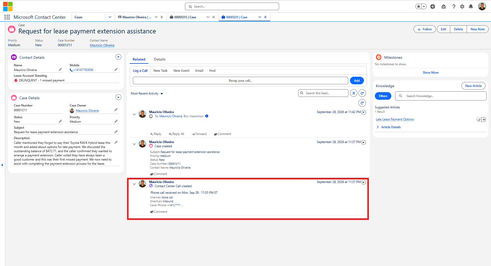
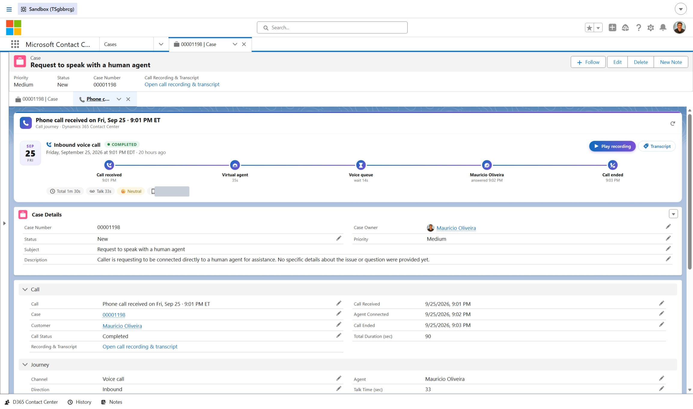
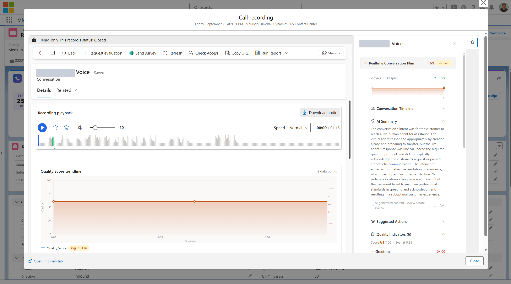
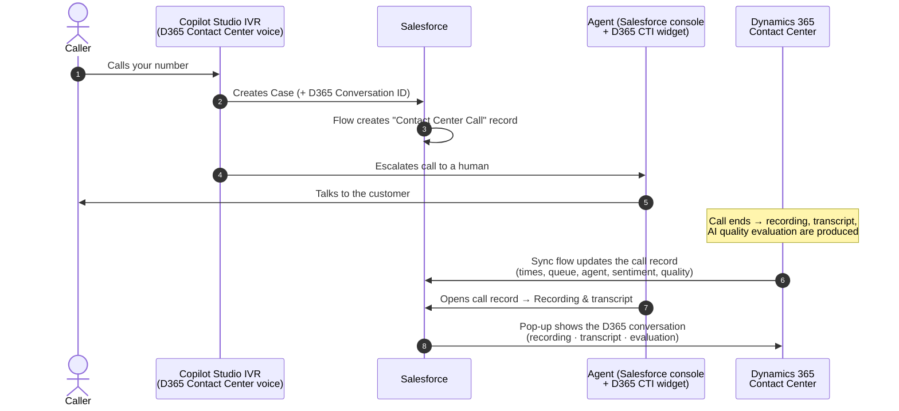
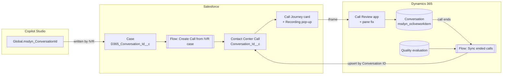
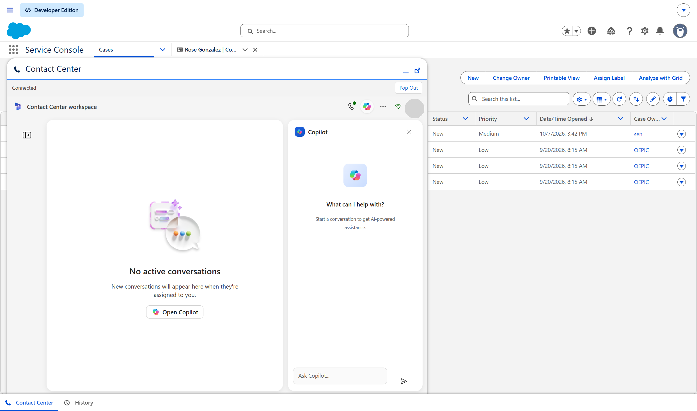
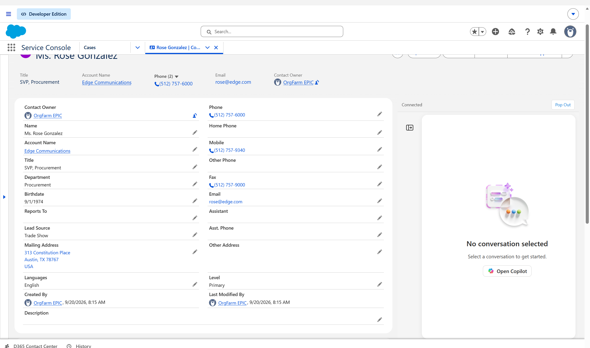

# Dynamics 365 Contact Center ✕ Salesforce — Call Journey

**Your agents work in Salesforce. Your calls run on Dynamics 365 Contact Center.**
This project connects the two, so every phone call shows up in Salesforce with its full story:

- when it came in
- how long the virtual agent (IVR) handled it
- how long the caller waited
- who answered
- how the customer felt
- one click to **play the recording, read the transcript and see the AI quality evaluation**, without leaving Salesforce

> 🧩 Everything in this repo is **ready to install**: one `.zip` for Salesforce, one `.zip` for Dynamics 365, and two small changes in Copilot Studio. No coding required. Prefer to hand it over? [Let an AI assistant install it for you](#let-an-ai-assistant-install-it-for-you) by pasting one prompt.

## What it looks like

**1. The IVR creates the Case, and the call shows up on it.** The Case header gets a *Call Recording & Transcript* link, and the feed shows *"Contact Center Call created"* with the call's time, channel, direction and caller.



**2. Open the call to see its whole journey.** *Call received → Virtual agent → Voice queue → Agent answered → Call ended*, with durations, sentiment and caller number. One click on **Recording & transcript** opens the Dynamics 365 recording, transcript and quality evaluation in a pop-up inside Salesforce. The card has the same design as the [ServiceNow version](https://github.com/moliveirapinto/d365-contact-center-servicenow-call-journey).



**3. Play the recording without leaving Salesforce.** The pop-up shows the Dynamics 365 conversation: audio player with waveform, quality score trendline, transcript and call metrics. On the right is the **AI quality evaluation**: plan score, AI summary, suggested actions and every quality indicator with its reasoning.



---

## Table of contents

1. [What you get](#what-you-get)
2. [How it works](#how-it-works)
3. [Before you start](#before-you-start) (including how to get a free Salesforce org)\r\n   - [Choose your connector](#choose-your-connector): Option A, the new Edge widget; Option B, the classic connector
4. [Let an AI assistant install it for you](#let-an-ai-assistant-install-it-for-you)
5. [Install in 4 steps](#install-in-4-steps)
6. [What's in this repo](#whats-in-this-repo)
7. [Customizing](#customizing)
8. [Troubleshooting](#troubleshooting)
9. [Optional extras](#optional-extras)
10. [Uninstalling](#uninstalling)
11. [Disclaimer & license](#disclaimer--license)

---

## What you get

### In Salesforce

| Feature | What the agent sees |
|---|---|
| **Contact Center Call record** | One record per phone call, created automatically when the IVR opens a Case. Title reads like *"Phone call received on Fri, Sep 25 · 9:24 PM ET"*. It's linked to the Case and the Contact. |
| **Call Journey card** | A visual timeline on top of the call record: *Call received → Virtual agent → Queue → Agent answered → Call ended*, with the call's date and time, status, durations, sentiment and the caller's number. Same design as the ServiceNow version. |
| **Recording & transcript button** | Open a large pop-up **inside Salesforce** showing the Dynamics 365 conversation: audio player, transcript, AI summary, call metrics and the **Quality Evaluation** side pane. |
| **Case link** | A *"Call Recording & Transcript"* link on the Case (optional; you add it to your Case layout). |
| **Call details** | Queue, agent, talk/wait/handle time, sentiment and quality score, filled in automatically when the call ends. |

### In Dynamics 365 Contact Center

| Component | Purpose |
|---|---|
| **Contact Center Call Review** app | A lightweight, full-screen conversation viewer, used by the Salesforce pop-up. |
| **Evaluation Details pane fix** | Fixes Microsoft's *"Error loading control"* in the Quality Evaluation side pane (see [why](#why-the-evaluation-pane-fix-is-needed)). |
| **Sync flow** (Power Automate) | When a voice call ends, it sends the call metrics and the AI quality evaluation to the matching Salesforce call record. |

### In Copilot Studio (your IVR agent)

The IVR agent writes the **Dynamics 365 conversation ID** into the Salesforce Case it creates. That one value is what ties everything together.

---

## How it works





---

## Before you start

You need:

| ✔ | Requirement |
|---|---|
| ☐ | **Dynamics 365 Contact Center** with a **voice** channel, and a **Copilot Studio agent** answering calls (the IVR) |
| ☐ | The **Dynamics 365 Contact Center for Salesforce** panel inside the Salesforce console, either the new **Edge widget** or the **classic connector**, already working (see [Choose your connector](#choose-your-connector)) |
| ☐ | Your Copilot Studio IVR **creates a Salesforce Case** before handing the call to an agent (Salesforce connector → *Create record*). If yours doesn't yet, the Copilot Studio guide shows the one action to add. |
| ☐ | **Salesforce**: a System Administrator login (a **sandbox** is recommended for your first try) |
| ☐ | **Dynamics 365 / Power Platform**: System Administrator or System Customizer in the Contact Center environment |
| ☐ | *(Optional)* **Quality evaluation** enabled in Dynamics 365 Contact Center, if you want quality scores |

⏱ **Time needed:** about 30–45 minutes the first time.

### Don't have a Salesforce org? Get a free one

A free **Salesforce Developer Edition** org is the easiest way to try this package. It is a full Salesforce org with Service Cloud and the Service Console, it costs nothing and it needs no credit card.

1. Go to **https://developer.salesforce.com/signup**.
2. Fill in the form: first and last name, **your work or personal email**, a **role**, **company** and country. Set **Username** to anything that looks like an email address and is **unique across all of Salesforce** (it does not have to be a real mailbox), for example `yourname.d365test@example.com`. Remember it: this is your admin login.
3. Accept the terms and click **Sign me up**.
4. Open the **verification email** (check spam) and click **Verify Account**. Choose a **password** and a security question. You land in your new org, already signed in as a System Administrator.
5. Note your org's address, for example `https://orgfarm-xxxxxxxx-dev-ed.develop.lightning.my.salesforce.com`. Your login URL is `https://login.salesforce.com` (not `test.salesforce.com`, which is only for sandboxes). Tell the AI assistant that it is a **Developer Edition** org.
6. Make sure the **Service Console** app is available: click the app launcher (nine dots) and search for **Service Console**. If it is missing, go to **Setup → App Manager** and check that *Service Console* is listed.

Good to know:
- A Developer Edition org is meant for learning and testing. **Do not put real customer data in it.**
- Salesforce may delete a Developer Edition org that stays **unused for a long time**, so log in from time to time.
- Salesforce changes its sign-up page now and then (some forms offer a Developer Edition with extra features such as Agentforce). Any **Developer Edition** works for this package. If the page above has changed, search for *"Salesforce Developer Edition sign up"* on developer.salesforce.com.
- The first time you sign in, Salesforce may ask you to confirm your identity with a code sent by email.
---

## Choose your connector

Salesforce can show the Dynamics 365 Contact Center panel in two ways. The call journey in this repo works with **both**, because it is filled in by Dynamics 365 in the background, not by the panel.

| | **Option A: Contact Center Edge widget** (new) | **Option B: Classic connector** (Open CTI softphone) |
|---|---|---|
| Panel | New "Edge" agent desktop, served from the Microsoft Pulse portal (`portal.us.contactcenterai.powerplatform.com`) | Older widget served from `ccaas-embed-prod.azureedge.net` |
| Installed as | A Salesforce package (an install link from your Microsoft contact) plus the config in this repo | A Call Center plus the Open CTI softphone utility item |
| Where it sits | Utility bar (bottom of every page) or docked on a record page | Utility bar only |
| Copilot panel | Yes (use the layout preset `compact`) | Limited |
| Native Salesforce click-to-dial | Optional extra step (Open CTI) | Yes |
| Contact screen pop | Needs a small host component (see [what changes](#what-changes-with-the-edge-widget)) | Built in |

Use **Option A** for new installs. Use **Option B** if you already run the classic connector or need the built-in screen pop today.

---

### Option A: Install the Contact Center Edge widget



*The Edge widget in the Service Console utility bar, with the Copilot panel open (header Copilot icon, top right of the widget).*

**What you install**

| # | What | Where it comes from |
|---|---|---|
| 1 | The **D365 Contact Center Edge** Salesforce package (Lightning component `d365EdgeContainer`) | The install link (`04t…`) that **your Microsoft contact** gives you. It is not in this repo. |
| 2 | **Two Trusted Sites** (Pulse portal with microphone, and Microsoft sign-in) | [`salesforce-edge/D365ContactCenter_Edge_Config_Salesforce.zip`](salesforce-edge) in this repo |
| 3 | The widget on the **utility bar** (and optionally a **docked** record page) | Setup steps below; ready-made examples in [`salesforce-edge/examples/`](salesforce-edge/examples) |
| 4 | The **Dynamics 365 side** (voice channel, agents, content security policy) | Same checklist as Option B, STEP 6 of the [classic prompt](#option-b-install-the-classic-salesforce-connector) |
| 5 | The **call journey** packages | The rest of this README, unchanged |

**The settings that matter**

| Property | Value | Why |
|---|---|---|
| Org URL | `https://<your org>.crm.dynamics.com` | Your Dynamics 365 environment |
| Edge URL | `https://portal.us.contactcenterai.powerplatform.com/experience/agent` | Use the regional portal URL your Microsoft contact gives you |
| **Layout Preset** | **`compact`** | `embedded` shows only the inbox and conversation, **with no Copilot panel**; `compact` and `full` include it |
| Screen Pop Mode | `navigate` (utility bar) or `publish` (docked page) | See below |
| Utility item label / size | `Contact Center`, width 1000, height 800, **Preload component** on | A tall panel is needed for the conversation and Copilot side by side |

**Need help installing the Edge widget? Let an AI assistant do it.** Paste the prompt below into **Claude** (with browser or computer use), **Claude Code** or a similar agent. You sign in yourself, including MFA.

> ✅ **Nothing to edit.** Paste the prompt as it is. It starts by asking you for your Salesforce org, your Dynamics 365 URL and the Microsoft package link.

````text
You are a Salesforce installation engineer. Install the "Dynamics 365 Contact Center Edge" widget in MY Salesforce org so the Dynamics 365 Contact Center panel opens in the Service Console utility bar. Work carefully, change only what is listed, and verify every step.

REFERENCE
- This repository (https://github.com/moliveirapinto/d365-contact-center-salesforce-call-journey) is context only. The folder salesforce-edge/ holds the Trusted Sites zip and example utility bar / docked page files.
- Microsoft's installation guide for the Edge widget (the INSTALL guide that comes with the package) is the source of truth. If anything below disagrees with it, follow Microsoft, tell me what differs, and continue.
- Tested values: Edge URL https://portal.us.contactcenterai.powerplatform.com/experience/agent (use my regional portal URL if my Microsoft contact gave me a different one). Layout Preset: compact. Screen Pop Mode: navigate. Utility item: label "Contact Center", width 1000, height 800, preload (eager) on, icon call.

STEP 0 - ASK ME, THEN WAIT
Ask: (1) Which Salesforce org (Developer Edition, sandbox or production) and its login URL? (2) Which Lightning app gets the utility item (for example Service Console)? (3) My Dynamics 365 URL (https://<org>.crm.dynamics.com)? (4) The package install link (starts with 04t, or a https://<domain>/packaging/installPackage.apexp?p0=04t... URL) that my Microsoft contact gave me, and my regional Pulse portal URL if it is not the one above. (5) Which users should see the widget? (6) Can you use the Salesforce CLI (sf) or a browser, or should you guide me click by click? Then STOP and wait. If this is production, say so and get my explicit "yes" before changing anything.

STEP 1 - BACKUP AND CHECK (read only)
1. Sign-in: I sign in myself (MFA included).
2. Save the current utility bar of the app I named (sf project retrieve start --metadata FlexiPage:<utility bar name>, or Setup > App Manager > app > Edit > Utility Items screenshot) and tell me where the backup is.
3. Check what is already installed: Setup > Installed Packages, and whether the Lightning component d365EdgeContainer exists (sf data query -q "SELECT DeveloperName FROM LightningComponentBundle WHERE DeveloperName = 'd365EdgeContainer'" --use-tooling-api). If it is already installed, skip STEP 2.
4. If the org already has a Call Center for D365 or an Open CTI softphone utility item (the classic connector), ask me whether to keep it or remove it. Never run both: they would open two panels and ring twice.

STEP 2 - INSTALL THE EDGE PACKAGE
Open the install link I gave you while signed in to my org, choose "Install for Admins Only" (or the profiles I name), approve any third-party access, and wait for "Installation complete". VERIFY: Setup > Installed Packages lists it, and the Lightning component d365EdgeContainer exists. If I have no link, STOP and tell me to ask my Microsoft contact: the package is not public.

STEP 3 - TRUSTED SITES (microphone is required for voice)
Deploy salesforce-edge/D365ContactCenter_Edge_Config_Salesforce.zip from the repository, or create them in Setup > Trusted URLs:
1. D365ContactCenterEdge: https://portal.us.contactcenterai.powerplatform.com (use my regional URL if different). Active. Directives: frame-src, connect-src, img-src, media-src, and "Allow site to use microphone in Lightning Experience and Salesforce app pages" checked.
2. MicrosoftEntraSignIn: https://login.microsoftonline.com. Active. Same directives.
3. If my Dynamics 365 pages must also open inside Salesforce (the call journey's recording pop-up), also keep an active Trusted URL https://*.dynamics.com for frame-src (named D365_Contact_Center; it ships with this repo's Salesforce package, so check first and do not duplicate).
VERIFY: SELECT DeveloperName, EndpointUrl, IsActive FROM CspTrustedSite shows them active.

STEP 4 - UTILITY BAR
Setup > App Manager > my app > Edit > Utility Items > Add Utility Item > Custom > Lightning Component "d365EdgeContainer" (label shows as D365 Contact Center Edge). Set: Label "Contact Center", Icon "call", Panel Width 1000, Panel Height 800, Start automatically (preload) ON. Component properties: Org URL = my Dynamics 365 URL (no trailing slash), Edge URL = the portal URL, Layout Preset = compact, Screen Pop Mode = navigate. Keep the other utility items. Save.
VERIFY: reload the app; "Contact Center" is in the utility bar.

STEP 5 - DYNAMICS 365 SIDE
Do the same checks as STEP 6 of the classic prompt in the repository README (Contact Center installed with a voice workstream, agents have a license and the Omnichannel agent role, content security policy frame-ancestors include https://*.lightning.force.com and https://*.salesforce.com, browser pop-ups and third-party cookies allowed for Salesforce, [*.]microsoftonline.com, [*.]dynamics.com and [*.]powerplatform.com). Do not change roles or licenses without my "yes".

STEP 6 - FIRST SIGN-IN AND CHECK
1. Tell me to hard-refresh Salesforce (Ctrl+Shift+R) and click "Contact Center" in the utility bar.
2. Expected: the panel opens, shows "Connecting..." then "Sign in with Microsoft". I click it; a Microsoft pop-up opens; after sign-in the panel shows the status "Connected" and the Contact Center workspace (inbox, presence, Copilot icon).
3. IMPORTANT, tell me this: the "Open Copilot" button on the empty "No active conversations" screen does nothing in the current Microsoft preview. To open Copilot, click the Copilot icon in the widget's header (top right).
4. Troubleshooting: blocked icon or CSP error in the browser console = a Trusted Site is missing or inactive; sign-in pop-up blocked = allow pop-ups for the Salesforce domain; the microphone prompt appears on the first voice call (Allow); a panel with no Copilot at all = Layout Preset is "embedded", change it to "compact".

STEP 7 - FINAL REPORT
Give me a table: item (package, trusted sites, utility item, Dynamics 365 side, first sign-in) / status (OK, WARNING, FAILED) / what you saw. List what you changed, where the backup is, and how to roll back (restore the saved utility bar, delete the two Trusted Sites, uninstall the package). Then tell me the next step: install the call journey packages ("Let an AI assistant install it for you").

START with STEP 0.
````

**Optional: dock the widget on a record page.** Instead of (or besides) the utility bar, drag `d365EdgeContainer` into the sidebar of a record page in Lightning App Builder (Contact, Case, Account), with Screen Pop Mode `publish`, Container Height `70vh`, Min Height `545px`. Example page: [`salesforce-edge/examples/Contact_Edge_Docked.flexipage-meta.xml`](salesforce-edge/examples/Contact_Edge_Docked.flexipage-meta.xml). A docked panel only exists on the pages you add it to; the utility bar is the only placement that is on every page, so do not run both for the same agents.



#### What changes with the Edge widget

Everything the call journey does keeps working: the call records, Case creation, the Call Journey card, the recording and transcript pop-up and the Dynamics 365 sync flow all run on the Dynamics 365 side or in Salesforce, not inside the panel. Three things differ from the classic connector:

| Area | Classic connector | Edge widget |
|---|---|---|
| **Contact screen pop** | The classic widget searches Salesforce by phone number and opens the matching Contact. | The Edge widget sends the **Dynamics 365** customer record (type and ID), not a Salesforce ID. Salesforce can open a record only if a host component maps it to a Salesforce Contact or Case. Until you add that component, expect no automatic Salesforce pop. |
| **Click-to-dial** | Works out of the box. | Native phone fields say "click to dial disabled" until you complete the optional Open CTI step in Microsoft's guide. |
| **Panel size** | The CTI panel enlarger extra resizes it. | The enlarger does nothing; size comes from the utility item (1000 × 800). |
| **"Open Copilot" button** | n/a | The button on the empty screen does nothing in the current preview. Use the Copilot icon in the widget header. |

**Edge package files in this repo**

```
salesforce-edge/
├── D365ContactCenter_Edge_Config_Salesforce.zip   ← deploy: the two Trusted Sites (Salesforce metadata API format)
├── source/                                        ← the same content, unzipped
└── examples/
    ├── LightningService_UtilityBar.flexipage-meta.xml   ← utility bar example (replace YOURORG)
    └── Contact_Edge_Docked.flexipage-meta.xml           ← docked Contact page example
```

Deploy the zip with `sf project deploy start --metadata-dir salesforce-edge/D365ContactCenter_Edge_Config_Salesforce.zip --target-org <alias>`, or create the two Trusted Sites by hand in Setup → Trusted URLs.

---

### Option B: Install the classic Salesforce connector

#### Need help installing the classic Salesforce connector?

The call journey in this repo assumes the **Dynamics 365 Contact Center panel (the softphone) already works inside your Salesforce console**. If it does not yet, an AI assistant can set it up for you: paste the prompt below into **Claude** (with browser or computer use), **Claude Code**, or a similar agent that can run commands.

It sets up, in your own Salesforce org and Dynamics 365 environment:

1. a **Call Center** (the "D365" connector) that points to the Dynamics 365 Contact Center widget,
2. the **Trusted URL** that lets Salesforce show that widget (without it you get a blocked icon),
3. the **Open CTI softphone** in the Service Console utility bar, sized 1200 x 640,
4. the **users** who can see it,
5. the **Dynamics 365 side**: Contact Center and voice channel, agent licenses and roles, the widget address, and the content security policy that lets Salesforce show Dynamics 365,
6. a final **check** that the panel loads and signs in.

**You stay in control:** you sign in yourself (including MFA). The assistant changes nothing outside this list, shows you a backup first, and asks before touching a production org.

> ✅ **Nothing to edit.** Paste the prompt exactly as it is. The assistant starts by **asking you** for what it needs: your Salesforce org (sandbox, Developer Edition or production), your Dynamics 365 environment URL, and which users should see the panel. Have those ready. Anything in `<angle brackets>` is filled in by the assistant from your answers. You never type passwords: you sign in yourself in the browser, including MFA.

````text
You are a Salesforce installation engineer. Install the "Dynamics 365 Contact Center" connector (Open CTI softphone) in MY Salesforce org so the Dynamics 365 Contact Center panel opens inside the Salesforce console. Work carefully, change only what is listed, and verify every step.

REFERENCE
- This repository's README (https://raw.githubusercontent.com/moliveirapinto/d365-contact-center-salesforce-call-journey/main/README.md) is context only.
- Microsoft's official documentation is the source of truth for this connector. Search Microsoft Learn for "Dynamics 365 Contact Center Salesforce integration" and "Open CTI Call Center Salesforce Dynamics 365". If anything below disagrees with the current Microsoft documentation, follow Microsoft, tell me what differs, and continue.
- Values this install uses (they were tested and work):
  * Call Center internal name: Dynamics365CallCenter. Display name: D365.
  * CTI Adapter URL: https://ccaas-embed-prod.azureedge.net/widget/index.html?dynamicsUrl=<MY D365 ORG URL>/   (note the trailing slash)
  * Use CTI API: true. Softphone Height: 640. Softphone Width: 1200. Salesforce Compatibility Mode: Classic_and_Lightning.
  * Trusted URL: https://ccaas-embed-prod.azureedge.net, active, applicable to frame-src, connect-src, img-src and style-src.
  * Utility item: standard component "Open CTI Softphone" (opencti:softPhone), label "D365 Contact Center", width 1200, height 640, in the Service Console utility bar.

HOW TO WORK
- Use the tools you have (browser, shell, Salesforce CLI "sf"). If you cannot operate a browser, switch to GUIDE MODE: give me ONE step at a time with exact click paths, wait for me to say "done", and verify what I report before moving on.
- Never guess. If a screen or value differs from this prompt, STOP and tell me exactly what you see.
- Retry a failed action at most twice, then stop and show me the exact error.
- I sign in myself, including MFA. Never ask me to paste passwords or tokens in this chat and never store any.
- Do not delete or change anything that is not listed here. Never touch a different Salesforce org.
- After each step give a one-line status: OK / WARNING / FAILED.

STEP 0 - QUESTIONS (ask all in one message, then wait)
1. Salesforce org: sandbox, Developer Edition or production? Login URL or CLI alias, and admin username? If production, warn me and continue only after I answer "yes, production".
2. My Dynamics 365 Contact Center environment URL (for example https://contoso.crm.dynamics.com). It must start with https:// and end at ".dynamics.com" (no path). Use it exactly as I give it. It may also be a regional host such as crm4.dynamics.com.
3. Which Salesforce users (usernames) must see the D365 panel? Is it every agent, or specific people?
4. Which Salesforce Lightning app should show it (default: Service Console)? Does that app already have a utility bar?
5. Is there already a Call Center in this org (Setup > Call Centers) or an Open CTI softphone in the utility bar? (If you can check it yourself, do so and tell me instead of asking.)
6. Confirm I have: (a) a Salesforce System Administrator login, (b) a Dynamics 365 Contact Center user with an agent license who can sign in to the environment above, (c) a browser that allows pop-ups and third-party cookies for my Salesforce domain (see STEP 7), (d) a Power Platform / Dynamics 365 administrator login for the environment above, which STEP 6 needs.

STEP 1 - PREFLIGHT (read-only)
1. Sign in: with the Salesforce CLI "sf org login web --alias <alias>" (add --instance-url https://test.salesforce.com for a sandbox), or in the browser. I complete the sign-in.
2. Check what already exists, and tell me before changing anything:
   - Call Centers: sf data query -q "SELECT Id, InternalName, Name, AdapterUrl FROM CallCenter"
   - Users already assigned: sf data query -q "SELECT Id, Username, CallCenterId FROM User WHERE CallCenterId != null"
   - Trusted URLs: sf data query --use-tooling-api -q "SELECT DeveloperName, EndpointUrl, IsActive FROM CspTrustedSite"
   - Utility bar of the target app: Setup > App Manager > (app) > Edit > Utility Items, or retrieve it with: sf project retrieve start -m FlexiPage:<UtilityBar name> (find it with the Tooling API: SELECT DeveloperName, MasterLabel FROM FlexiPage WHERE Type='UtilityBar')
3. If a Call Center for D365 already exists, STOP and ask me whether to update it or leave it.
4. BACKUP: save the current utility bar FlexiPage XML to a local folder (for example "backup-before-d365-connector") and tell me where it is. This is how to roll back.

STEP 2 - CALL CENTER
1. UI route (preferred, always works): Setup > Call Centers. If Salesforce shows an introduction page, click Continue. Click Import and upload an XML file with this content (replace <D365 ORG URL> with mine, keep the trailing slash). Save it as D365CallCenter.xml:

<?xml version="1.0" encoding="UTF-8"?>
<callCenter>
  <section sortOrder="0" name="reqGeneralInfo" label="General Information">
    <item sortOrder="0" name="reqInternalName" label="InternalName">Dynamics365CallCenter</item>
    <item sortOrder="1" name="reqDisplayName" label="Display Name">D365</item>
    <item sortOrder="2" name="reqAdapterUrl" label="CTI Adapter URL">https://ccaas-embed-prod.azureedge.net/widget/index.html?dynamicsUrl=<D365 ORG URL>/</item>
    <item sortOrder="3" name="reqUseApi" label="Use CTI API">true</item>
    <item sortOrder="4" name="reqSoftphoneHeight" label="Softphone Height">640</item>
    <item sortOrder="5" name="reqSoftphoneWidth" label="Softphone Width">1200</item>
    <item sortOrder="6" name="reqSalesforceCompatibilityMode" label="Salesforce Compatibility Mode">Classic_and_Lightning</item>
  </section>
</callCenter>

2. Alternative with the CLI (metadata deploy): create force-app/main/default/callCenters/Dynamics365CallCenter.callCenter-meta.xml with <adapterUrl>, <displayName>D365</displayName> and the five items above in a <sections> block named reqGeneralInfo, plus <customSettings> JSON {"reqSoftphoneHeight":"640","reqUseApi":"true","reqSoftphoneWidth":"1200","reqSalesforceCompatibilityMode":"Classic_and_Lightning"}, then run: sf project deploy start --source-dir force-app --target-org <alias>. Use this only if the import fails.
3. VERIFY: open the Call Center record and confirm every field, and that the CTI Adapter URL contains MY org URL and ends with "/". Query: SELECT InternalName, Name, AdapterUrl FROM CallCenter must return exactly one D365 row.

STEP 3 - ASSIGN USERS
1. On the Call Center page click "Manage Call Center Users" > "Add More Users", filter, tick the users I named, then Add to Call Center. (A user can belong to only ONE call center; if one is already in another, STOP and ask me.)
2. VERIFY with: SELECT Username FROM User WHERE CallCenterId = '<the call center Id>' and compare to my list.

STEP 4 - TRUSTED URL
1. Setup > Trusted URLs > New Trusted URL. API Name: D365_CCaaS_Embed. URL: https://ccaas-embed-prod.azureedge.net. Active: ticked. Context: All. Tick the CSP directives: frame-src, connect-src, img-src and style-src. Save. (Equivalent metadata: CspTrustedSite with endpointUrl https://ccaas-embed-prod.azureedge.net, isApplicableToFrameSrc/ConnectSrc/ImgSrc/StyleSrc true, isActive true, context All.)
2. Also make sure my Dynamics 365 org URL (https://<my org>.crm.dynamics.com, plus the https://*.dynamics.com wildcard if my org uses a regional host) is an active Trusted URL for frame-src and connect-src. If the Salesforce package of this repo is installed it already contains BOTH Trusted URLs (D365_CCaaS_Embed and D365_Contact_Center, the latter for https://*.dynamics.com), so check first and do not add duplicates.
3. VERIFY: SELECT DeveloperName, EndpointUrl, IsActive FROM CspTrustedSite (Tooling API) shows both URLs active.

STEP 5 - UTILITY BAR (Open CTI softphone)
1. Setup > App Manager > Service Console (or the app I named) > Edit > Utility Items > Add Utility Item > "Open CTI Softphone". Label: D365 Contact Center. Icon: people (any). Panel Width 1200. Panel Height 640. Keep the other existing utility items (History, Notes, ...). Save.
2. Do not add a second Open CTI softphone. If an old connector item exists (for example another softphone or a custom "Edge" container), ask me before removing it, and keep the backup from STEP 1.
3. VERIFY: reload the Service Console; the utility bar shows "D365 Contact Center" at the bottom. Query the FlexiPage again and confirm it contains componentName opencti:softPhone exactly once.

STEP 6 - DYNAMICS 365 SIDE (the panel only works if this is in place; check each item and report)
Sign-in: ask me to sign in at https://admin.powerplatform.microsoft.com with a Dynamics 365 / Power Platform administrator account, and use the environment I named. Menu names change between releases; if a name differs, search for it and tell me what you found.
1. Contact Center is installed and has a voice channel. Power Platform admin center > Environments > my environment > Resources > Dynamics 365 apps: "Dynamics 365 Contact Center" (and the "Copilot Service admin center" app) must be installed. Open the Copilot Service admin center (the app is listed as "Copilot Service admin center" in the environment's app list) and confirm under Customer support > Workstreams (and Channels) that a workstream of type Voice exists with a phone number or an Azure Communication Services resource. If not, STOP: the connector cannot work without Contact Center and a voice channel, and setting that up is a separate Microsoft guide (Learn: "Set up Dynamics 365 Contact Center"); tell me.
2. Agents. Every person who will use the panel needs (a) a Dynamics 365 Contact Center (or Customer Service Enterprise + Omnichannel) license, (b) a Dynamics 365 user in this environment with the security role "Omnichannel agent" (or "Customer Service Representative"), and (c) membership in a queue/workstream that receives voice calls. Check each user I listed in Step 0 and report what is missing. Do not change roles or licenses without my "yes".
3. Widget address. In the Copilot Service admin center go to Get started > Home, find the tile "Your default contact center" and click Open, then open the "Conversation widget" tab. Under "2. Integration into third-party systems" read the "Embeddable conversation widget URL" (it looks like https://ccaas-embed-prod.azureedge.net/widget/index.html?dynamicsUrl=https://<my org>.crm.dynamics.com). Compare it with the address used in this install (ignore a trailing slash, both work) (https://ccaas-embed-prod.azureedge.net/widget/index.html?dynamicsUrl=<my D365 URL>/). If Microsoft's current URL is different, use Microsoft's URL in the Call Center CTI Adapter URL (STEP 2) and tell me what differs. If the setting does not exist in my environment, tell me and continue with the address above.
4. Allow Salesforce to frame Dynamics 365 (needed for the Recording & transcript pop-up). Power Platform admin center > Environments > my environment > Settings (the "Environment admin center" settings page) > Product > Privacy + Security > scroll to "Content security policy" and open the "App (model-driven)" tab. If "Enforce content security policy" is Off, nothing is needed: note that and go on. If it is On, the frame-ancestors list must include these entries (keep the existing ones, add only what is missing): https://*.lightning.force.com, https://*.my.salesforce.com and https://*.salesforce.com (plus my My Domain host if it is a different pattern). Show me the exact list before saving.
5. Browser. The agent signs in to Dynamics 365 inside the panel, in a pop-up. Pop-ups and third-party cookies must be allowed for my Salesforce domains, [*.]dynamics.com, [*.]microsoftonline.com and [*.]azureedge.net (Edge: Settings > Cookies and site permissions; Chrome: Settings > Privacy and security > Third-party cookies > Sites that can always use cookies). If my company manages the browser by policy, tell me to ask IT.
6. Production caution: none of the items above change live calls, but the frame-ancestors change affects who can embed Dynamics 365. Say so and get my "yes" before saving it in a production environment.

STEP 7 - BROWSER CHECK AND FIRST SIGN-IN
1. Tell me to hard-refresh Salesforce (Ctrl+Shift+R) and click "D365 Contact Center" in the utility bar.
2. Expected: the panel opens at about 1200 x 640 and shows "Signing in... Complete the sign in process in pop-up". A Microsoft sign-in pop-up opens. I sign in with my Dynamics 365 agent account. Afterwards the panel shows the agent presence/status controls.
3. If the pop-up is blocked: allow pop-ups for my Salesforce domain. If the panel stays blank or says it cannot sign in: allow third-party cookies for [*.]dynamics.com, [*.]microsoftonline.com, [*.]azureedge.net and my Salesforce domain (Edge: Settings > Cookies and site permissions; Chrome: Settings > Privacy and security > Third-party cookies > Sites that can always use cookies), then retry in a normal (not private) window.
4. If I see a blocked/empty icon instead of the panel: the Trusted URL from STEP 4 is missing or inactive, or the browser console shows a "Refused to frame" / CSP error; fix the URL it names. If the console says the user is not allowed: STEP 3 was not completed for my user, or I am not a D365 Contact Center agent.
5. If the panel shows an HTTP 400 "Request Too Long" error: clear cookies for dynamics.com and microsoftonline.com and retry.

STEP 8 - FINAL REPORT
Give me a table: item (Call Center, users, Trusted URLs, utility item, first sign-in) / status (OK, WARNING, FAILED) / what you saw. List exactly what you changed, where the backup is, and how to roll back (restore the saved utility bar, remove the users from the call center, delete the Call Center and the Trusted URL D365_CCaaS_Embed). Then tell me the next step: install the call journey package from this README ("Let an AI assistant install it for you").

START with STEP 0.
````

### What this prompt cannot do for you

- It cannot sign in for you or accept the Microsoft sign-in pop-up.
- It needs your Dynamics 365 user to be a Contact Center agent with the right license; that is configured in Dynamics 365, not in Salesforce.
- If your company blocks third-party cookies or pop-ups by policy, your IT team has to allow them for the domains listed in STEP 7 and STEP 6.5.

## Let an AI assistant install it for you

This is the third step, after you have a Salesforce org and the Dynamics 365 panel works inside the Service Console (see the two sections above). Copy the whole prompt below into an AI assistant that can work in a browser and/or run commands (for example **Claude** with computer or browser use, **Claude Code**, or a similar agent). It asks you a few questions, installs everything in the right order (Salesforce, Dynamics 365, Copilot Studio), checks each step and finishes with a test call. If your assistant cannot operate a browser, the prompt switches to a guided mode where it walks you through each click.

**You stay in control:** you sign in yourself (including MFA), and the assistant stops and asks whenever something is not as expected or before anything that affects live calls.

> ✅ **Nothing to edit.** Paste the prompt exactly as it is. The assistant starts by **asking you** for what it needs: your Salesforce org (sandbox or production), your Dynamics 365 environment URL, your time zone, which users get access and the name of your Copilot Studio agent. Have those ready. Anything written in `<angle brackets>` or with an example value (such as `contoso.crm.dynamics.com`) is filled in by the assistant from your answers. You never type passwords: you sign in yourself in the browser, including MFA.

````text
You are an installation engineer. Install the community package "Dynamics 365 Contact Center x Salesforce Call Journey" for me, end to end, carefully and safely. It has three parts that must be done IN ORDER: Salesforce, then Dynamics 365, then Copilot Studio.

SOURCE
Repository: https://github.com/moliveirapinto/d365-contact-center-salesforce-call-journey
README (source of truth): https://raw.githubusercontent.com/moliveirapinto/d365-contact-center-salesforce-call-journey/main/README.md
Step guides: docs/1-install-salesforce.md, docs/2-install-dynamics365.md, docs/3-configure-copilot-studio.md, docs/4-test-and-troubleshoot.md (same repository, main branch).
Files:
  A) Salesforce package (do NOT unzip): https://raw.githubusercontent.com/moliveirapinto/d365-contact-center-salesforce-call-journey/main/salesforce/D365ContactCenter_CallJourney_Salesforce.zip
  B) Dynamics 365 solution (do NOT unzip): https://raw.githubusercontent.com/moliveirapinto/d365-contact-center-salesforce-call-journey/main/dynamics365/D365ContactCenterSalesforceCallJourney_1_1_1_0.zip
  C) Copilot Studio topic: https://raw.githubusercontent.com/moliveirapinto/d365-contact-center-salesforce-call-journey/main/copilot-studio/d365-context-variables-topic.yaml
Read the README and the four step guides first. If they and this prompt disagree, follow the repository and tell me.

HOW TO WORK
- Use the tools you have (browser, shell, Salesforce CLI "sf", file download). If you cannot operate a browser, switch to GUIDE MODE: give me ONE step at a time with exact click paths, wait for me to say "done", and check what I report before moving on. If you cannot open URLs, ask me to paste the README and guides and to download the files myself.
- Never guess. If a screen, value or count differs from what this prompt says, STOP and tell me exactly what you see.
- Retry a failed action at most twice. Then stop and show me the exact error.
- Only do what is listed here. Do not delete or change any other record, field, flow, topic, form or solution. Never touch a Salesforce org, Power Platform environment or Copilot Studio agent other than the ones I name.
- Sign-in: I sign in myself, including MFA. Tell me when you need it, then wait. Do not ask me to paste passwords or tokens into this chat, and never store any.
- Anything that can affect LIVE calls (publishing the Copilot Studio agent, turning on the sync flow in a production environment, deploying to a production Salesforce org) needs my explicit "yes" first. Say what will change.
- After each phase give me one or two lines of status (OK / WARNING / FAILED) before you continue.

PHASE 0 - QUESTIONS (ask all in one message, then wait)
1. Salesforce: sandbox or production? Which org (alias or login URL) and which admin username? If it is production, warn me and continue only after I answer an explicit "yes, production". A sandbox is recommended for a first try.
2. Dynamics 365: the Contact Center environment URL (for example https://contoso.crm.dynamics.com) and the environment's name as shown in Power Apps.
3. Time zone for call titles, as three values: standard-time offset from UTC in hours (for example -5), daylight saving rule (US, EU, or blank if none) and a short label (for example ET). Common values: US Eastern -5/US/ET; US Central -6/US/CT; US Mountain -7/US/MT; US Pacific -8/US/PT; Brazil -3/blank/BRT; UK and Ireland 0/EU/GMT; Central Europe 1/EU/CET; India 5.5/blank/IST; Sydney 10/blank/AEST. Blank for all three means UTC.
4. Salesforce users who need the permission set "D365 Contact Center Call Access": (a) every agent who uses the Salesforce console, (b) the Salesforce user the Copilot Studio agent uses to create Cases, (c) the Salesforce user for the Power Automate connection (often an integration user). Give me usernames.
5. Copilot Studio: the name of the IVR agent. Does it already create a Salesforce Case (Salesforce connector, "Create record", object Case) before transferring to a human agent? Is this agent used by LIVE callers right now?
6. Which Dataverse security roles do the agents have (for example Omnichannel agent, Customer Service Representative, Quality Manager)? The Contact Center Call Review app will be shared with them.
7. Optional Case extras, yes or no each: (a) "Call Recording & Transcript" link in the Case header (compact layout), (b) a Contact Center Calls related list on Case and Contact, (c) the Call Timeline component on the Case page.
8. Confirm I can sign in to: (a) Salesforce as a System Administrator, (b) Power Apps with System Administrator or System Customizer in the Contact Center environment, (c) Copilot Studio as a maker of the IVR agent. Also confirm the Dynamics 365 Contact Center widget (CTI) already works inside the Salesforce console, and that Contact Center has a voice channel.

PHASE 1 - PREFLIGHT
1. Download files A, B and C. Expected sizes: A 24,975 bytes, B 13,614 bytes (different only if the README names newer files). A must be a valid zip whose first entry is package.xml; B a valid zip containing solution.xml, customizations.xml, a Workflows/*.json file and a WebResources/ file.
2. Salesforce, once I have signed in: check that the object Contact_Center_Call__c and the field Case.D365_Conversation_Id__c do NOT exist yet. Check the field with the Tooling API, not with "sf sobject describe" (describe hides fields the user has no permission for): sf data query --use-tooling-api -q "SELECT DeveloperName FROM CustomField WHERE EntityDefinition.QualifiedApiName='Case' AND DeveloperName LIKE 'D365%'". If they exist, an earlier version may be installed: STOP, tell me, and ask whether to upgrade over it.
3. Power Apps, once signed in to the right environment: confirm it has the table "Conversation" (logical name msdyn_ocliveworkitem). If not, STOP. Check whether the solution "D365 Contact Center - Salesforce Call Journey" (unique name D365ContactCenterSalesforceCallJourney) already exists; if it does, tell me its version and ask before importing over it.

PHASE 2 - SALESFORCE PACKAGE (docs/1-install-salesforce.md)
1. Preferred, with the Salesforce CLI: sign in with "sf org login web --alias <alias>" (add --instance-url https://test.salesforce.com for a sandbox); I complete the sign-in in the browser.
2. VALIDATE FIRST, changing nothing: sf project deploy start --metadata-dir <path to the downloaded file A> --single-package --target-org <alias> --dry-run --wait 10
   Expect Succeeded with 49 components and 0 errors. If it fails, STOP and show me the failing component and reason. A known cause is "Field D365_Conversation_Id__c already exists": I must rename my own field first.
3. After I approve, run the same command WITHOUT --dry-run (same file path). Leave the test level at its default (the package has no Apex code). Expect Succeeded, 49 components.
4. No CLI? Use Workbench (https://workbench.developerforce.com): choose Sandbox or Production, log in, migration > Deploy, choose file A, tick "Rollback On Error" and "Single Package", Next, Deploy, wait for Succeeded.
5. Verify and report each item: objects Contact_Center_Call__c and D365_Contact_Center_Settings__c exist; Case has fields D365_Conversation_Id__c and D365_Call_Recording__c (check them with the Tooling API query from Phase 1; "sf sobject describe Case" will NOT list them until the permission set is assigned in Phase 4, which is normal); the flow D365CC_Create_Call_From_Case is ACTIVE (Tooling API: SELECT DeveloperName, ActiveVersionId FROM FlowDefinition WHERE DeveloperName='D365CC_Create_Call_From_Case', ActiveVersionId must not be empty); the permission set D365_Contact_Center_Call_Access exists; the two Trusted URLs are active: D365_Contact_Center (https://*.dynamics.com) and D365_CCaaS_Embed (https://ccaas-embed-prod.azureedge.net, which the D365 Contact Center panel in the Salesforce console needs) (SELECT DeveloperName, IsActive, EndpointUrl FROM CspTrustedSite WHERE DeveloperName IN ('D365_Contact_Center','D365_CCaaS_Embed')).

PHASE 3 - SALESFORCE SETTINGS
Write the org-level default of the custom setting "D365 Contact Center Settings". Run this Apex (sf apex run --file, or Developer Console > Execute Anonymous), with my real values and leaving out any line for a value I left blank:
  D365_Contact_Center_Settings__c s = D365_Contact_Center_Settings__c.getOrgDefaults();
  s.Org_Url__c = 'https://contoso.crm.dynamics.com';
  s.Time_Zone_Offset__c = -5;
  s.Daylight_Saving_Rule__c = 'US';
  s.Time_Zone_Label__c = 'ET';
  upsert s;
Leave App_Id__c (Call Review App ID) empty for now; Phase 5 fills it. Verify with SELECT Org_Url__c, App_Id__c, Time_Zone_Offset__c, Daylight_Saving_Rule__c, Time_Zone_Label__c FROM D365_Contact_Center_Settings__c and confirm exactly one org-level row with my values. If the Apex route fails, do it in the UI: Setup > Custom Settings > D365 Contact Center Settings > Manage > New (the one at the top, "Default Organization Level Value") and fill the fields.

PHASE 4 - ACCESS
Assign the permission set to every user I listed: sf org assign permset --name D365_Contact_Center_Call_Access --on-behalf-of <username> --target-org <alias> (once per user, or repeat the flag). Verify with SELECT Assignee.Username FROM PermissionSetAssignment WHERE PermissionSet.Name='D365_Contact_Center_Call_Access' and confirm each user is listed. Then run "sf sobject describe --sobject Case" again: D365_Conversation_Id__c and D365_Call_Recording__c must now be listed. If an assignment fails because of a license problem, STOP and tell me which user.

PHASE 5 - DYNAMICS 365 (docs/2-install-dynamics365.md)
1. Open https://make.powerapps.com, ask me to sign in, and select the environment I named.
   Also check the content security policy that lets Salesforce show Dynamics 365 in the Recording & transcript pop-up: Power Platform admin center > Environments > my environment > Settings > Product > Privacy + Security > Content security policy > "App (model-driven)" tab. If "Enforce content security policy" is On, the frame-ancestors list must allow https://*.lightning.force.com and https://*.my.salesforce.com (and my My Domain host). Show me the list and ask before adding. If enforcement is Off, nothing is needed. The Contact Center panel itself is covered by the section "Need help installing the Salesforce connector?"; if the panel does not open, use that prompt first.
2. Solutions > Import solution > Browse > file B > Next. On the connections page:
   - "D365 Contact Center - Dataverse": select my Microsoft Dataverse connection, or create one (I sign in).
   - "D365 Contact Center - Salesforce": create a new Salesforce connection, login type Production or Sandbox to match my org, and I sign in with the Salesforce user that received the permission set in Phase 4.
   Click Import and wait for "Solution imported successfully".
3. Open the solution "D365 Contact Center - Salesforce Call Journey" > Cloud flows > "D365 Contact Center - Sync ended calls to Salesforce". If this is a production environment, ask me before turning it on. Turn it ON. If Turn on is greyed out, open each item under Connection references, choose a connection, Save, then retry. Reload and confirm it shows On.
4. Conversation form fix (do it carefully, change nothing else on the form): Tables > Conversation (msdyn_ocliveworkitem) > Forms > "Conversation Form" (type Main) > in the designer open Form libraries (left rail) > Add library > search new_d365cc_evaluationpanefix > tick it > Add. Click an empty area so the FORM itself is selected, open the Events tab, under On load click Event handler and set: Library new_d365cc_evaluationpanefix.js; Function D365CC.EvaluationPaneFix.onLoad; Enabled ON; Pass execution context as first parameter ON. Done > Save and publish. If that exact handler already exists, do not add a second one. Reopen the form and confirm the handler is there.
5. Share the app: Apps > "Contact Center Call Review" > ... > Share. Add the security roles I named (never "everyone") > Share.
6. Get the app id: Apps > "Contact Center Call Review" > Play. In the browser address bar copy the value after appid= .
7. Put it into Salesforce: run the Phase 3 Apex again with one more line, s.App_Id__c = '<app id>'; keep the other values, upsert, then re-run the verification query and confirm App_Id__c is set.

PHASE 6 - COPILOT STUDIO (docs/3-configure-copilot-studio.md)
Ask me to sign in at https://copilotstudio.microsoft.com and open the IVR agent I named.
A) Make the conversation id available.
   1. Topics > Add a topic > From blank, name it exactly: D365 Context Variables. (If a topic with that name exists, open it instead of creating another.)
   2. Top right ... > Open code editor, and replace everything with file C exactly:
        kind: AdaptiveDialog
        beginDialog:
          kind: OnRedirect
          id: main
          actions:
            - kind: SetVariable
              id: setVariable_d365ConversationIdType
              variable: Global.msdyn_ConversationId
              value: =""

        inputType: {}
        outputType: {}
   3. Save. Open the Variables pane > Global > msdyn_ConversationId and tick "External sources can set values". Save.
B) Write it into the Case.
   1. Find the action that creates the Salesforce Case: Salesforce connector, "Create record", object type Case. It is usually in the Escalate topic before "Transfer conversation".
   2. Refresh the action so it sees the new Salesforce field (the action's ... menu > Refresh, or re-select object type Case).
   3. Add the input "D365 Conversation ID" and set its value, in Formula (fx) mode, to exactly: If(IsBlank(Global.msdyn_ConversationId), "", Text(Global.msdyn_ConversationId))
   4. Do the same in any retry "Create record" action for Case in the same flow. Change no other input.
   5. If the agent creates NO Case at all: STOP and ask me. Adding one changes how live calls behave. Only if I say yes, add the action before Transfer conversation per docs/3-configure-copilot-studio.md (object Case; Subject; Origin = Phone; Supplied Phone = Text(System.Activity.From.Name); D365 Conversation ID as above) using a Salesforce user that has the permission set.
C) Save. Then, BEFORE publishing, tell me the agent is used by live callers (if it is) and ask for my explicit "yes, publish". Publish. Confirm the publish succeeded.

PHASE 7 - OPTIONAL CASE EXTRAS (only the ones I said yes to; docs/1-install-salesforce.md section 1.5)
(a) Setup > Object Manager > Case > Compact Layouts > Compact Layout Assignment > Edit Assignment > choose "Case Highlights with Call Recording" > Save. If a custom Case compact layout is already assigned, add the field "Call Recording & Transcript" to it instead.
(b) Setup > Object Manager > Case (and Contact) > Page Layouts > my layout > Related Lists > drag "Contact Center Calls" > Save.
(c) Open a Case > gear > Edit Page > drag "Call Timeline (D365 Contact Center)" onto the page > Save > Activate.
Do not change anything else on those layouts or pages.

PHASE 8 - END-TO-END TEST (docs/4-test-and-troubleshoot.md)
Ask me to call my Contact Center number, ask the IVR for an agent, answer in the Dynamics 365 widget inside Salesforce, talk briefly, end the call and close the conversation. Do not create fake data. (Only if I cannot place a call right now, offer the Salesforce-only SMOKE TEST below, and run it only after my explicit yes.) Then check, read-only:
- A new Case exists with the conversation id filled: SELECT CaseNumber, D365_Conversation_Id__c FROM Case ORDER BY CreatedDate DESC LIMIT 5
- Within seconds a Contact_Center_Call__c record exists, linked to that Case, with status In progress: SELECT Id, Name FROM Contact_Center_Call__c ORDER BY CreatedDate DESC LIMIT 5, then open it.
- 1 to 2 minutes after the call ends the record shows status Completed with queue, agent, talk and wait time and sentiment (the quality score fills in once Dynamics 365 has produced the evaluation).
- In Salesforce open the call record: the Call Journey card shows, and the "Recording & transcript" button opens a large pop-up with the Dynamics 365 recording player, the Transcript tab with text, and the Quality Evaluation side pane WITHOUT the message "Error loading control".
SMOKE TEST (optional, Salesforce only, needs my explicit yes; it creates two clearly labelled test records and deletes them again):
1. Create a Case: sf data create record --sobject Case --values "Subject='ZZ TEST install check (delete me)' Origin=Phone Status=New D365_Conversation_Id__c='00000000-0000-0000-0000-installtest01'" --target-org <alias>
2. Wait about 15 seconds, then run: SELECT Id, Name, Status__c, Direction__c FROM Contact_Center_Call__c WHERE Conversation_Id__c='00000000-0000-0000-0000-installtest01'. Expect exactly one row, status In progress, whose Name ends with my time zone label (for example "ET"). That proves the flow, the settings and the permission set work.
3. Optionally open that call record in Salesforce to see the Call Journey card and the Recording & transcript button (the pop-up cannot play anything for a fake conversation id; that is expected).
4. Delete both test records: sf data delete record --sobject Contact_Center_Call__c --record-id <id> and sf data delete record --sobject Case --record-id <id>. Confirm that no row with that conversation id and no Case with a Subject starting "ZZ TEST" remains.If something is missing, use the Troubleshooting section of the README and docs/4-test-and-troubleshoot.md. Look first at the sync flow's run history in Power Automate (a run ending in "No_Salesforce_case_for_this_call" is normal for calls that did not come through the IVR), then at Setup > Paused and Failed Flow Interviews in Salesforce. Report what you find. Do not change anything else without asking me.

STOP AND ASK ME WHENEVER
- a check, count or screen differs from this prompt,
- you are asked to sign in, approve MFA, accept terms or pay for anything,
- the target is production and I have not said "yes, production",
- the next action could affect live calls and I have not said yes,
- you would have to do something that is not in this prompt.

FINAL REPORT
Give me a table with every phase and its result, then: (1) anything I still have to do by hand, (2) which Salesforce users hold the permission set and which Salesforce user the sync flow connection uses, (3) a link to the README Troubleshooting section and the Uninstalling section, (4) a reminder that this is a community sample, not an official Microsoft or Salesforce product, and that a sandbox test comes first.
````
## Install in 4 steps

| Step | Where | Guide | Time |
|---|---|---|---|
| **1** | Salesforce | [Install the Salesforce package](docs/1-install-salesforce.md) | 10 min |
| **2** | Dynamics 365 | [Import the Dynamics 365 solution](docs/2-install-dynamics365.md) | 10 min |
| **3** | Copilot Studio | [Send the conversation ID to Salesforce](docs/3-configure-copilot-studio.md) | 10 min |
| **4** | Both | [Connect, test & troubleshoot](docs/4-test-and-troubleshoot.md) | 5 min |

> 💡 Do them **in order**. Step 3 needs the Salesforce field from step 1, and step 4 needs the app ID from step 2.

---

## What's in this repo

```
.
├── salesforce/
│   ├── D365ContactCenter_CallJourney_Salesforce.zip   ← install this in Salesforce (Step 1)
│   └── source/                                        ← the same content, unzipped (for reading / version control)
├── dynamics365/
│   ├── D365ContactCenterSalesforceCallJourney_1_1_1_0.zip  ← import this in Dynamics 365 (Step 2)
│   └── webresource-source/new_d365cc_evaluationpanefix.js  ← readable copy of the Conversation form fix script
├── copilot-studio/
│   ├── d365-context-variables-topic.yaml              ← paste into a new topic (Step 3)
│   └── create-case-field-mapping.md                   ← the one field to add to your "Create Case" action
├── salesforce-edge/                                   ← NEW: Edge widget config (Trusted Sites zip + examples)
├── extras/
│   ├── salesforce-cti-panel-enlarger/                 ← optional: bigger panel for the CLASSIC connector only
│   └── edge-chrome-extension/                         ← optional: browser helper for demo machines
└── docs/                                              ← step-by-step guides
```

### Salesforce package contents

| Type | Name | What it is |
|---|---|---|
| Custom object | `Contact_Center_Call__c` | One record per call (29 custom fields, record page, layout, tab, compact layout) |
| Custom fields on Case | `D365_Conversation_Id__c`, `D365_Call_Recording__c` | The link between the Case and the D365 conversation |
| Compact layout on Case | `D365CC_Case_Highlights` | Optional: shows the recording link in the Case header |
| Custom setting | `D365_Contact_Center_Settings__c` | Where you enter **your** Dynamics 365 URL, app ID and time zone (nothing is hard-coded) |
| Flow | `D365CC_Create_Call_From_Case` | Creates the call record when the IVR creates a Case (runs in the background; it can never block Case creation) |
| Lightning components | `callTimeline`, `callRecordingModal` | The Call Journey card and the recording pop-up |
| Lightning page | `Contact_Center_Call_Page` | Record page for calls: journey card + related Case + details |
| Trusted URL | `D365_Contact_Center` | Lets Salesforce show `https://*.dynamics.com` in the pop-up |
| Trusted URL | `D365_CCaaS_Embed` | Lets Salesforce show the Dynamics 365 Contact Center panel (`https://ccaas-embed-prod.azureedge.net`) in the console utility bar |
| Permission set | `D365_Contact_Center_Call_Access` | Gives users access to all of the above |

### Dynamics 365 solution contents (`D365ContactCenterSalesforceCallJourney`, unmanaged)

| Type | Name |
|---|---|
| Model-driven app + site map | **Contact Center Call Review** (`new_ContactCenterCallReview`) |
| Web resource (JavaScript) | `new_d365cc_evaluationpanefix.js` |
| Cloud flow | **D365 Contact Center - Sync ended calls to Salesforce** |
| Connection references | *D365 Contact Center - Dataverse*, *D365 Contact Center - Salesforce* |

---

## Customizing

| I want to… | Do this |
|---|---|
| **Change the time zone in call titles** | Setup → Custom Settings → **D365 Contact Center Settings** → *Time Zone Offset*, *Daylight Saving Rule*, *Time Zone Label* ([examples](docs/1-install-salesforce.md#13-tell-salesforce-where-your-dynamics-365-is-and-your-time-zone)). The Call Journey card always uses each user's own Salesforce time zone and locale. |
| **Show calls on the Case or Contact page** | Lightning App Builder → drag **Call Timeline (D365 Contact Center)** onto the Case or Contact record page. It lists all calls for that record. |
| **Use a different D365 app in the pop-up** | Put that app's ID in the Salesforce custom setting (**Call Review App ID**), or leave it blank to use the user's default app. |
| **Rename labels / fields** | Everything is unmanaged, so edit it freely in Setup. |

---

## Troubleshooting

The full list is in [docs/4-test-and-troubleshoot.md](docs/4-test-and-troubleshoot.md). The most common ones:

| Symptom | Fix |
|---|---|
| Pop-up says *"refused to connect"* | Make sure the Trusted URL `D365_Contact_Center` (`https://*.dynamics.com`, frame-src) is **active**: Setup → Trusted URLs. If the **D365 Contact Center panel** (softphone) shows a blocked icon instead, activate `D365_CCaaS_Embed` (`https://ccaas-embed-prod.azureedge.net`). |
| **Edge widget:** the "Open Copilot" button does nothing | Known in the current preview. Click the **Copilot icon in the widget header** instead. If there is no Copilot panel at all, set the component's **Layout Preset** to `compact` (the `embedded` preset has none). |
| **Edge widget:** blocked icon, or a console error about frames or the microphone | Check the Trusted Sites `D365ContactCenterEdge` and `MicrosoftEntraSignIn` are active, with frame-src and the microphone directive. |
| **Edge widget:** a call arrives but no Salesforce Contact opens | Expected until you add a host component that maps the Dynamics 365 customer to a Salesforce Contact (see [What changes with the Edge widget](#what-changes-with-the-edge-widget)). The call and Case records are still created. |
| Pop-up is empty / Play button missing | Fill in **D365 Contact Center Settings** (Step 1.3). |
| *"Error loading control"* in the Evaluation pane, or an empty Transcript tab in the pop-up | Add the Conversation form fix (Step 2.3). |
| No call record created | The Case has no `D365 Conversation ID`: check Step 3. Also check the running user has the permission set. |
| Call record never shows metrics / quality | The sync flow is off or its Salesforce connection user lacks the permission set (Step 2.2). |
| A very short call (under a minute) has no metrics | Fixed in solution 1.1.1.0: the sync flow retries once after a minute, in case the call record was not created yet. Import 1.1.1.0 over your version. |
| D365 pages stuck on the loading spinner (often right after publishing customizations) | Clear the site data for `*.crm.dynamics.com` (keeps you signed in if you keep cookies) and reload. |
| Pop-up blocked by *"frame-ancestors"* | Your Dynamics 365 environment enforces a content security policy. In the Power Platform admin center, add your Salesforce domains (`https://*.lightning.force.com`, `https://*.my.salesforce.com`) to its allowed frame ancestors. |

### Nothing is hard-coded

Every organization-specific value is entered by you after installing:

| Value | Where you set it |
|---|---|
| Dynamics 365 environment URL (any region) | Salesforce → Custom Settings → D365 Contact Center Settings |
| Which D365 app opens in the pop-up | same place (*Call Review App ID*) |
| Time zone of call titles (offset, daylight saving, label) | same place |
| Time zone & language of dates on the Call Journey card | each Salesforce user's personal settings (automatic) |
| Salesforce org used by the sync flow | the Salesforce **connection** you pick when importing the D365 solution |
| Dataverse environment | wherever you import the solution |
| Which Salesforce user the IVR uses | your Copilot Studio agent's Salesforce connection |
| Trusted URL for the pop-up | `https://*.dynamics.com`, which covers every D365 environment and region |

### Why the evaluation pane fix is needed

Microsoft's **Evaluation Details** control (`MscrmControls.OC.OCEvaluationDetailsControl`) uses the Fluent UI v8 library (`FluentUIReact`) but doesn't declare it as a dependency. It only works in apps where another control happens to load Fluent UI first (e.g. the multi-session Customer Service workspace). Everywhere else (Customer Service Hub, custom apps, and embedded views like the Salesforce pop-up) it fails with **"Error loading control"**.

`new_d365cc_evaluationpanefix.js` loads the exact Fluent UI v8 build that the platform ships (from the same Power Apps CDN) before the pane opens. In apps that already have Fluent UI, it does nothing.

### Why the transcript fix is needed

Microsoft's transcript loader (`msdyn_ChatControl.htm`) starts by reading `window.top.Xrm`. Opened directly in Dynamics 365, the top window *is* Dynamics 365, so it works. Inside the Salesforce pop-up, the top window is Salesforce, the browser blocks that cross-site read, the loader stops, and the **Transcript** tab stays blank. Recording, metrics and evaluation don't make that call, so they still work. No setting changes this.

When, and only when, the conversation is shown inside another site and the transcript area stays empty, the same script reads the conversation's transcript (the `msdyn_transcript` record's message file, using the signed-in user's own permissions) and shows it in the Transcript tab. You get speaker, time and message, and Microsoft's **Search** box and **Download transcript** button keep working. Opened directly in Dynamics 365, Microsoft's control is left untouched.

---

## Optional extras

| Extra | What it does | Install |
|---|---|---|
| [`extras/salesforce-cti-panel-enlarger`](extras/salesforce-cti-panel-enlarger/README.md) | Makes the D365 Contact Center panel in Salesforce much larger and easier to read, for everyone in the org | Salesforce zip + add one utility item |
| [`extras/edge-chrome-extension`](extras/edge-chrome-extension/README.md) | For demo laptops: enlarges the panel, cleans up stale sign-in cookies (*"HTTP 400 – Request Too Long"*) and clears D365's local cache at browser start | Load unpacked in Edge/Chrome |

---

## Uninstalling

- **Salesforce:** delete the flow, the Lightning page, the components, the permission set, the custom setting, the Case fields and the `Contact_Center_Call__c` object (Setup → Object Manager). The two Trusted URLs (`D365_Contact_Center`, `D365_CCaaS_Embed`) can be deactivated.
- **Dynamics 365:** remove the handler/library from the Conversation form (Step 2.3 in reverse), then delete the solution components (app, flow, web resource, connection references).
- **Copilot Studio:** remove the *D365 Conversation ID* field from your Create Case action and delete the *D365 Context Variables* topic.

---

## Disclaimer & license

This is a **community sample**, not an official Microsoft or Salesforce product, and it is **not supported** by either company. It uses documented, supported extension points (Salesforce metadata, Lightning Web Components, Power Automate, Dataverse web resources). The evaluation-pane fix works around a platform issue and may become unnecessary, or need updating, after future Dynamics 365 releases. Test in a sandbox first.

Released under the [MIT License](LICENSE).


