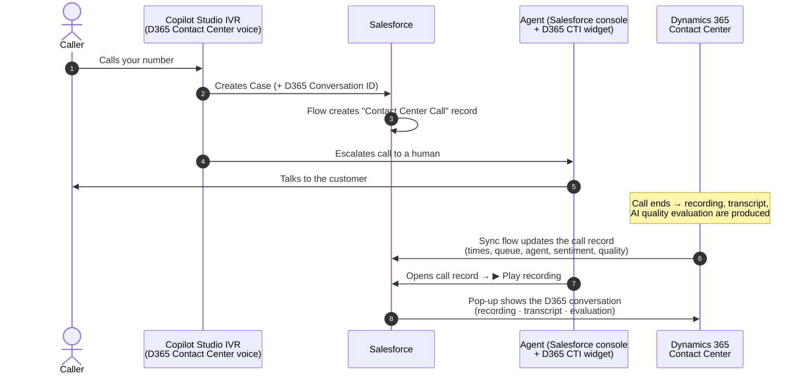
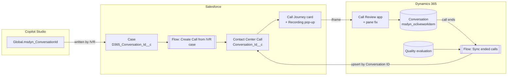

# Dynamics 365 Contact Center ✕ Salesforce — Call Journey

**Your agents work in Salesforce. Your calls run on Dynamics 365 Contact Center.**
This project connects the two, so every phone call shows up in Salesforce with its full story:

- when it came in
- how long the virtual agent (IVR) handled it
- how long the caller waited
- who answered
- how the customer felt
- one click to **play the recording, read the transcript and see the AI quality evaluation**, without leaving Salesforce

> 🧩 Everything in this repo is **ready to install**: one `.zip` for Salesforce, one `.zip` for Dynamics 365, and two small changes in Copilot Studio. No coding required.

## What it looks like

**1. The IVR creates the Case, and the call shows up on it.** The Case header gets a *Call Recording & Transcript* link, and the feed shows *"Contact Center Call created"* with the call's time, channel, direction and caller.


**2. Open the call to see its whole journey.** *Call received → Virtual agent → Voice queue → Agent answered → Call ended*, with durations, sentiment and caller number. One click on **▶ Play recording** or **Transcript** opens the Dynamics 365 recording, transcript and quality evaluation in a pop-up inside Salesforce.


**3. Play the recording without leaving Salesforce.** The pop-up shows the Dynamics 365 conversation: audio player with waveform, quality score trendline, transcript and call metrics. On the right is the **AI quality evaluation**: plan score, AI summary, suggested actions and every quality indicator with its reasoning.


---

## Table of contents

1. [What you get](#what-you-get)
2. [How it works](#how-it-works)
3. [Before you start](#before-you-start)
4. [Install in 4 steps](#install-in-4-steps)
5. [What's in this repo](#whats-in-this-repo)
6. [Customizing](#customizing)
7. [Troubleshooting](#troubleshooting)
8. [Optional extras](#optional-extras)
9. [Uninstalling](#uninstalling)
10. [Disclaimer & license](#disclaimer--license)

---

## What you get

### In Salesforce

| Feature | What the agent sees |
|---|---|
| **Contact Center Call record** | One record per phone call, created automatically when the IVR opens a Case. Title reads like *"Phone call received on Fri, Sep 25 · 9:24 PM ET"*. It's linked to the Case and the Contact. |
| **Call Journey card** | A visual timeline on the call record: *Call received → Virtual agent → Queue → Agent answered → Call ended*. It shows times, durations, sentiment and the caller's number. |
| **▶ Play recording / Transcript buttons** | Open a large pop-up **inside Salesforce** showing the Dynamics 365 conversation: audio player, transcript, AI summary, call metrics and the **Quality Evaluation** side pane. |
| **Case link** | A *"Call Recording & Transcript"* link on the Case (optional; you add it to your Case layout). |
| **Call details** | Queue, agent, talk/wait/handle time, sentiment and quality score, filled in automatically when the call ends. |

### In Dynamics 365 Contact Center

| Component | Purpose |
|---|---|
| **Contact Center Call Review** app | A lightweight, full-screen conversation viewer, used by the Salesforce pop-up. |
| **Evaluation Details pane fix** | Fixes Microsoft's *"Error loading control"* in the Quality Evaluation side pane (see [why](#why-the-evaluation-pane-fix-is-needed)). |
| **Sync flow** (Power Automate) | When a voice call ends, it sends the call metrics and the AI quality evaluation to the matching Salesforce call record. |

### In Copilot Studio (your IVR agent)

The IVR agent writes the **Dynamics 365 conversation ID** into the Salesforce Case it creates. That one value is what ties everything together.

---

## How it works





---

## Before you start

You need:

| ✔ | Requirement |
|---|---|
| ☐ | **Dynamics 365 Contact Center** with a **voice** channel, and a **Copilot Studio agent** answering calls (the IVR) |
| ☐ | The **Dynamics 365 Contact Center for Salesforce** integration (the CTI widget inside the Salesforce console) already working |
| ☐ | Your Copilot Studio IVR **creates a Salesforce Case** before handing the call to an agent (Salesforce connector → *Create record*). If yours doesn't yet, the Copilot Studio guide shows the one action to add. |
| ☐ | **Salesforce**: a System Administrator login (a **sandbox** is recommended for your first try) |
| ☐ | **Dynamics 365 / Power Platform**: System Administrator or System Customizer in the Contact Center environment |
| ☐ | *(Optional)* **Quality evaluation** enabled in Dynamics 365 Contact Center, if you want quality scores |

⏱ **Time needed:** about 30–45 minutes the first time.

---

## Install in 4 steps

| Step | Where | Guide | Time |
|---|---|---|---|
| **1** | Salesforce | [Install the Salesforce package](docs/1-install-salesforce.md) | 10 min |
| **2** | Dynamics 365 | [Import the Dynamics 365 solution](docs/2-install-dynamics365.md) | 10 min |
| **3** | Copilot Studio | [Send the conversation ID to Salesforce](docs/3-configure-copilot-studio.md) | 10 min |
| **4** | Both | [Connect, test & troubleshoot](docs/4-test-and-troubleshoot.md) | 5 min |

> 💡 Do them **in order**. Step 3 needs the Salesforce field from step 1, and step 4 needs the app ID from step 2.

---

## What's in this repo

```
.
├── salesforce/
│   ├── D365ContactCenter_CallJourney_Salesforce.zip   ← install this in Salesforce (Step 1)
│   └── source/                                        ← the same content, unzipped (for reading / version control)
├── dynamics365/
│   ├── D365ContactCenterSalesforceCallJourney_1_1_0_0.zip  ← import this in Dynamics 365 (Step 2)
│   └── webresource-source/new_d365cc_evaluationpanefix.js  ← readable copy of the Conversation form fix script
├── copilot-studio/
│   ├── d365-context-variables-topic.yaml              ← paste into a new topic (Step 3)
│   └── create-case-field-mapping.md                   ← the one field to add to your "Create Case" action
├── extras/
│   ├── salesforce-cti-panel-enlarger/                 ← optional: bigger D365 widget panel in Salesforce
│   └── edge-chrome-extension/                         ← optional: browser helper for demo machines
└── docs/                                              ← step-by-step guides
```

### Salesforce package contents

| Type | Name | What it is |
|---|---|---|
| Custom object | `Contact_Center_Call__c` | One record per call (29 custom fields, record page, layout, tab, compact layout) |
| Custom fields on Case | `D365_Conversation_Id__c`, `D365_Call_Recording__c` | The link between the Case and the D365 conversation |
| Compact layout on Case | `D365CC_Case_Highlights` | Optional: shows the recording link in the Case header |
| Custom setting | `D365_Contact_Center_Settings__c` | Where you enter **your** Dynamics 365 URL, app ID and time zone (nothing is hard-coded) |
| Flow | `D365CC_Create_Call_From_Case` | Creates the call record when the IVR creates a Case (runs in the background; it can never block Case creation) |
| Lightning components | `callTimeline`, `callRecordingModal` | The Call Journey card and the recording pop-up |
| Lightning page | `Contact_Center_Call_Page` | Record page for calls: journey card + related Case + details |
| Trusted URL | `D365_Contact_Center` | Lets Salesforce show `https://*.dynamics.com` in the pop-up |
| Permission set | `D365_Contact_Center_Call_Access` | Gives users access to all of the above |

### Dynamics 365 solution contents (`D365ContactCenterSalesforceCallJourney`, unmanaged)

| Type | Name |
|---|---|
| Model-driven app + site map | **Contact Center Call Review** (`new_ContactCenterCallReview`) |
| Web resource (JavaScript) | `new_d365cc_evaluationpanefix.js` |
| Cloud flow | **D365 Contact Center - Sync ended calls to Salesforce** |
| Connection references | *D365 Contact Center - Dataverse*, *D365 Contact Center - Salesforce* |

---

## Customizing

| I want to… | Do this |
|---|---|
| **Change the time zone in call titles** | Setup → Custom Settings → **D365 Contact Center Settings** → *Time Zone Offset*, *Daylight Saving Rule*, *Time Zone Label* ([examples](docs/1-install-salesforce.md#13-tell-salesforce-where-your-dynamics-365-is-and-your-time-zone)). The Call Journey card always uses each user's own Salesforce time zone and locale. |
| **Show calls on the Case or Contact page** | Lightning App Builder → drag **Call Timeline (D365 Contact Center)** onto the Case or Contact record page. It lists all calls for that record. |
| **Use a different D365 app in the pop-up** | Put that app's ID in the Salesforce custom setting (**Call Review App ID**), or leave it blank to use the user's default app. |
| **Rename labels / fields** | Everything is unmanaged, so edit it freely in Setup. |

---

## Troubleshooting

The full list is in [docs/4-test-and-troubleshoot.md](docs/4-test-and-troubleshoot.md). The most common ones:

| Symptom | Fix |
|---|---|
| Pop-up says *"refused to connect"* | Make sure the Trusted URL `D365_Contact_Center` (`https://*.dynamics.com`, frame-src) is **active**: Setup → Trusted URLs. |
| Pop-up is empty / Play button missing | Fill in **D365 Contact Center Settings** (Step 1.3). |
| *"Error loading control"* in the Evaluation pane, or an empty Transcript tab in the pop-up | Add the Conversation form fix (Step 2.3). |
| No call record created | The Case has no `D365 Conversation ID`: check Step 3. Also check the running user has the permission set. |
| Call record never shows metrics / quality | The sync flow is off or its Salesforce connection user lacks the permission set (Step 2.2). |
| D365 pages stuck on the loading spinner (often right after publishing customizations) | Clear the site data for `*.crm.dynamics.com` (keeps you signed in if you keep cookies) and reload. |
| Pop-up blocked by *"frame-ancestors"* | Your Dynamics 365 environment enforces a content security policy. In the Power Platform admin center, add your Salesforce domains (`https://*.lightning.force.com`, `https://*.my.salesforce.com`) to its allowed frame ancestors. |

### Nothing is hard-coded

Every organization-specific value is entered by you after installing:

| Value | Where you set it |
|---|---|
| Dynamics 365 environment URL (any region) | Salesforce → Custom Settings → D365 Contact Center Settings |
| Which D365 app opens in the pop-up | same place (*Call Review App ID*) |
| Time zone of call titles (offset, daylight saving, label) | same place |
| Time zone & language of dates on the Call Journey card | each Salesforce user's personal settings (automatic) |
| Salesforce org used by the sync flow | the Salesforce **connection** you pick when importing the D365 solution |
| Dataverse environment | wherever you import the solution |
| Which Salesforce user the IVR uses | your Copilot Studio agent's Salesforce connection |
| Trusted URL for the pop-up | `https://*.dynamics.com`, which covers every D365 environment and region |

### Why the evaluation pane fix is needed

Microsoft's **Evaluation Details** control (`MscrmControls.OC.OCEvaluationDetailsControl`) uses the Fluent UI v8 library (`FluentUIReact`) but doesn't declare it as a dependency. It only works in apps where another control happens to load Fluent UI first (e.g. the multi-session Customer Service workspace). Everywhere else (Customer Service Hub, custom apps, and embedded views like the Salesforce pop-up) it fails with **"Error loading control"**.

`new_d365cc_evaluationpanefix.js` loads the exact Fluent UI v8 build that the platform ships (from the same Power Apps CDN) before the pane opens. In apps that already have Fluent UI, it does nothing.

### Why the transcript fix is needed

Microsoft's transcript loader (`msdyn_ChatControl.htm`) starts by reading `window.top.Xrm`. Opened directly in Dynamics 365, the top window *is* Dynamics 365, so it works. Inside the Salesforce pop-up, the top window is Salesforce, the browser blocks that cross-site read, the loader stops, and the **Transcript** tab stays blank. Recording, metrics and evaluation don't make that call, so they still work. No setting changes this.

When, and only when, the conversation is shown inside another site and the transcript area stays empty, the same script reads the conversation's transcript (the `msdyn_transcript` record's message file, using the signed-in user's own permissions) and shows it in the Transcript tab. You get speaker, time and message, and Microsoft's **Search** box and **Download transcript** button keep working. Opened directly in Dynamics 365, Microsoft's control is left untouched.

---

## Optional extras

| Extra | What it does | Install |
|---|---|---|
| [`extras/salesforce-cti-panel-enlarger`](extras/salesforce-cti-panel-enlarger/README.md) | Makes the D365 Contact Center panel in Salesforce much larger and easier to read, for everyone in the org | Salesforce zip + add one utility item |
| [`extras/edge-chrome-extension`](extras/edge-chrome-extension/README.md) | For demo laptops: enlarges the panel, cleans up stale sign-in cookies (*"HTTP 400 – Request Too Long"*) and clears D365's local cache at browser start | Load unpacked in Edge/Chrome |

---

## Uninstalling

- **Salesforce:** delete the flow, the Lightning page, the components, the permission set, the custom setting, the Case fields and the `Contact_Center_Call__c` object (Setup → Object Manager). The Trusted URL can be deactivated.
- **Dynamics 365:** remove the handler/library from the Conversation form (Step 2.3 in reverse), then delete the solution components (app, flow, web resource, connection references).
- **Copilot Studio:** remove the *D365 Conversation ID* field from your Create Case action and delete the *D365 Context Variables* topic.

---

## Disclaimer & license

This is a **community sample**, not an official Microsoft or Salesforce product, and it is **not supported** by either company. It uses documented, supported extension points (Salesforce metadata, Lightning Web Components, Power Automate, Dataverse web resources). The evaluation-pane fix works around a platform issue and may become unnecessary, or need updating, after future Dynamics 365 releases. Test in a sandbox first.

Released under the [MIT License](LICENSE).
